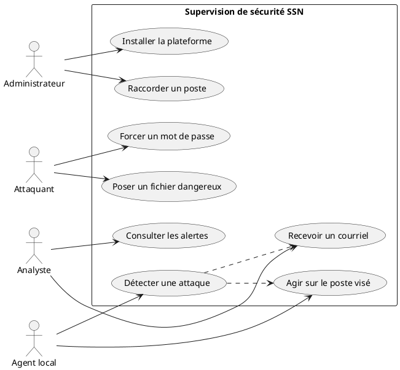
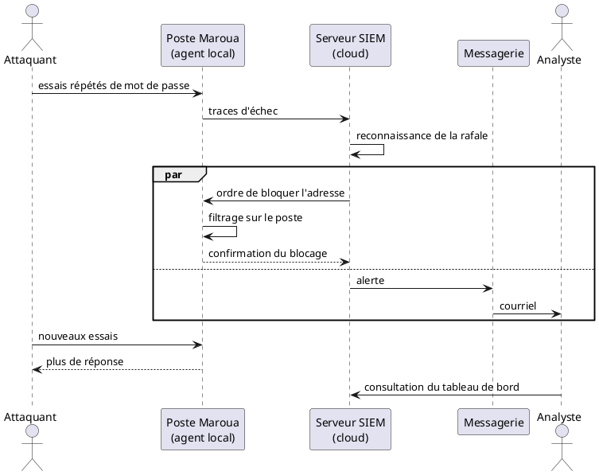
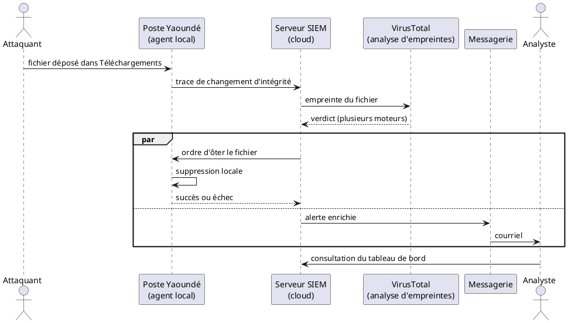
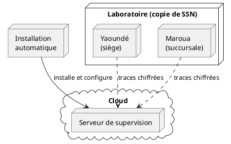

<!--
Note Word — Guide ISJ 2025 (retirer avant impression) :
- Times New Roman 12, justifié, interligne 1,15, retrait 1 cm, marges 2,5 cm.
- Pagination bas à droite. Texte noir. Recto uniquement.
- Titre et source SOUS chaque figure. Tableau d’auteur : pas de source.
- Volume du chapitre 3 (Ingé 4) : 12 pages. Ne pas aérer ni condenser au-delà.
- Coller dans rapport-de-stage.docx à la place du titre vide du chapitre 3.
- Tableaux III.1 et III.2. Figures 3.1 à 3.7, plus 3.0a à 3.0d (UML).
- Réserver les cadres « COURRIEL » pour les captures de la boîte mail (hauteur ~8 cm).
- Exporter les PlantUML en PNG. Détail de configuration : annexe A.
- Abréviation à ajouter en page liminaire : VirusTotal (VT).
-->

# Chapitre 3 : Solution Proposée

## Introduction du chapitre

Le chapitre 2 dresse un diagnostic net. System Security Network (SSN) protège mal ses postes de travail. Ces postes occupent le siège de Yaoundé et la succursale de Maroua. Aucun lien privé ne relie les deux villes. Chaque machine garde ses journaux chez elle. L’équipe n’agit que lorsqu’un utilisateur signale un blocage. Une intrusion reste donc invisible plusieurs semaines.

La même étude fixe déjà une orientation. Le cerveau de la supervision quitte le siège. Il migre dans le cloud. De petits programmes, les agents, demeurent sur les postes. Un réseau privé relie l’ensemble. Le présent chapitre convertit cette orientation en solution. Notre apport pour l’entreprise se situe ici.

Précisons le vocabulaire avant d’avancer. Un *Security Information and Event Management* (SIEM) rassemble les traces, les compare, puis lève une alerte. Un agent, logiciel léger, habite le poste et envoie ces traces. Une réponse active exécute, sur la machine visée, un geste automatique : bloquer une adresse, ôter un fichier, isoler l’hôte. Le *File Integrity Monitoring* (FIM) surveille les changements de fichiers. VirusTotal est un service d’analyse : il compare l’empreinte d’un fichier à de nombreux moteurs antivirus et dit s’il est dangereux. Le *Mean Time To Detect* (MTTD) mesure, en secondes ou en semaines, le délai moyen avant découverte. Le *Mean Time To Respond* (MTTR) mesure le délai moyen avant correction.

Nous retenons Wazuh comme SIEM. Owolafe et James (2024), déjà cités au tableau II, fondent ce choix : la plateforme surveille les postes, contrôle l’intégrité et répond toute seule, sans pile trop lourde.

La modélisation précède le déploiement. *Unified Modeling Language* (UML) montre qui agit, dans quel ordre, et sur quelle machine. Le lecteur n’a pas besoin du code pour suivre.

Deux sections composent le chapitre, selon le Guide de l’Institut Saint Jean (ISJ). La section 1 fixe les besoins, les schémas et l’architecture. La section 2 décrit l’installation, puis deux essais calés sur le diagnostic : une attaque par mot de passe à Maroua, un fichier altéré à Yaoundé. Dans les deux cas, la machine réagit. Un courriel prévient l’équipe en même temps.

---

## Section 1 : Analyse, modélisation et architecture de la solution

Cette section construit d’abord la solution sur le papier. Elle part des besoins de SSN. Elle les dessine. Elle nomme ensuite le rôle de chaque composant.

### 3.1.1. Démarche retenue et cahier des charges

#### 3.1.1.1. Une sécurité pensée dès la conception

Nous n’ajoutons pas la sécurité à la fin. Nous la plaçons dans chaque étape. Cinq temps s’enchaînent.

D’abord, nous planifions. Le parc de la Direction Technique mélange Windows, Linux et, parfois, macOS. Les deux villes n’ont pas de tunnel dédié. Il faut donc un serveur central joignable des deux côtés, et des agents discrets sur les postes.

Ensuite, nous décrivons l’infrastructure par écrit. L’ordinateur distant, ses règles d’accès et sa clé tiennent dans un fichier unique. Rien d’essentiel ne se clique à la main. On recrée l’ensemble. On l’efface aussi, proprement, quand il le faut.

Puis l’enchaînement automatique prend le relais. Chaque mise à jour validée déclenche trois gestes : vérifier les fichiers, créer la machine, installer le SIEM. L’opérateur n’apprend plus une litanie de commandes.

La détection vient alors. Le SIEM n’affiche pas seulement des courbes. Il donne un ordre à l’agent : bloquer l’attaquant, enlever un fichier dangereux, couper le poste du réseau local tout en gardant un accès d’administration.

Enfin, un courriel part. Le chapitre 2 a montré que personne ne lit les journaux en continu. Le message réveille l’humain. Il n’a pas vocation à remplacer l’action automatique. Il l’accompagne.

Cette boucle — prévoir, installer, détecter, agir, prévenir — fait de la sécurité une propriété du système. Elle n’est plus un contrôle extérieur, trop tardif.

#### 3.1.1.2. Besoins fonctionnels

Nous traduisons le diagnostic du chapitre 2 en cinq capacités. Chacune se constate sur la plateforme.

**BF-01 — Rassembler les traces.** Chaque poste envoie ses journaux vers le serveur central. Connexions distantes, changements de fichiers, gestes de défense : tout quitte la machine dès l’événement. Si un logiciel malveillant efface ensuite les fichiers locaux, la copie centrale existe déjà. Voilà la réponse au cloisonnement décrit plus tôt.

**BF-02 — Comprendre tout de suite.** Un échec isolé de mot de passe n’est pas une attaque. Une rafale l’est. Un fichier ajouté dans Téléchargements n’est pas forcément un virus. Le moteur relie ces faits. Il lève une alerte utile, pas un bruit.

**BF-03 — Agir sans ticket.** Le chapitre 2 a établi l’absence de procédure d’incident. La machine visée bloque elle-même l’adresse attaquante, ôte un fichier reconnu dangereux, ou se coupe du réseau local. L’attente d’un technicien n’est plus le premier rempart.

**BF-04 — Voir les deux sites sur un seul écran.** L’analyste n’ouvre plus une session à Yaoundé et une autre à Maroua. Un tableau unique présente les alertes, l’état des agents et le suivi des actions.

**BF-05 — Prévenir par courriel.** L’équipe n’intervient aujourd’hui qu’à la demande de l’utilisateur. Toute alerte grave produit donc un message. Ce message part en même temps que l’action. Ni l’un ni l’autre n’attend.

#### 3.1.1.3. Besoins non fonctionnels

Quatre qualités encadrent le tout.

Le lien entre les postes et le serveur se chiffre. Il ne traverse pas Internet en clair. Un réseau privé maillé joue ce rôle.

L’agent reste léger. Les postes du laboratoire n’égalent pas un grand serveur. On surveille les dossiers utiles, non la machine entière par des modules lourds.

Le serveur central survit à une panne du siège. Une coupure à Yaoundé n’aveugle plus Maroua. D’où le cloud pour le cerveau, et les postes pour les agents.

Le déploiement, enfin, se reproduit. Mots de passe et clés n’entrent pas dans le dossier partagé. Ils restent dans un coffre.

Le tableau III.1 relie chaque besoin à sa réponse. Ce n’est pas un catalogue d’outils. C’est la traduction, en capacités, du diagnostic. Un besoin laissé vide ne ferait que déplacer le problème des postes isolés.

```
+--------+----------------------------------+-------------------------------------------+
| Code   | Ce que SSN doit obtenir          | Comment la solution y répond              |
+--------+----------------------------------+-------------------------------------------+
| BF-01  | Traces centralisées              | Agents locaux, serveur dans le cloud      |
| BF-02  | Alerte dès que le motif est clair| Corrélation, puis VirusTotal si fichier      |
| BF-03  | Action sans attendre l’humain    | Blocage, suppression, isolement           |
| BF-04  | Vue unique des deux sites        | Tableau de bord unique                    |
| BF-05  | Réveil de l’équipe               | Courriel automatique                      |
| BNF-01 | Lien privé et chiffré            | Réseau maillé privé                       |
| BNF-02 | Agent discret                    | Surveillance ciblée des dossiers           |
| BNF-03 | Indépendance vis-à-vis du siège  | Serveur central dans le cloud             |
| BNF-04 | Reproductibilité, secrets protégés| Installation automatique, coffre         |
+--------+----------------------------------+-------------------------------------------+
```

**Tableau III.1 :** Correspondance entre les besoins de SSN et la solution proposée

---

### 3.1.2. Démarche de modélisation et langage UML

Le Guide ISJ demande d’indiquer la méthode et le langage. Notre démarche descend. Nous partons des personnes et de leurs actes. Nous ordonnons ensuite les messages. Nous plaçons enfin chaque pièce sur une machine.

UML fournit le dessin. Quatre vues suffisent. La première répond à « qui fait quoi ? ». Les deux suivantes, des diagrammes de séquence, répondent à « dans quel ordre ? » : l’une pour la force brute, l’autre pour le fichier dangereux. La dernière répond à « où cela s’exécute-t-il ? ».

#### 3.1.2.1. Diagramme de cas d’utilisation

Quatre acteurs apparaissent. L’administrateur installe la plateforme. L’analyste lit le tableau de bord et les courriels. L’agent local collecte les traces et exécute les ordres. L’attaquant fournit les stimuli : mot de passe forcé ou fichier dangereux.



**Figure 3.0a :** Acteurs et cas d’utilisation de la solution  
**Source :** Nos travaux, modélisation UML (2026)

Le point décisif tient au double départ. Dès la détection, une action part vers le poste. Un courriel part vers l’analyste. L’un n’attend pas l’autre.

#### 3.1.2.2. Diagramme de séquence d’une force brute

Ce diagramme occupe une place centrale. Il raconte, dans le temps, ce que le chapitre 2 décrivait comme impossible : voir la rafale, bloquer l’adresse, prévenir l’équipe, et le faire **ensemble**. L’attaquant frappe un poste de Maroua. L’agent envoie les échecs. Le serveur reconnaît la série. Il ordonne le filtrage. Il dépose, en parallèle, un courriel.



**Figure 3.0b :** Diagramme de séquence d’une force brute, avec blocage local et courriel parallèle  
**Source :** Nos travaux, modélisation UML (2026)

Lisons le schéma de haut en bas. L’attaquant envoie des essais. Le poste les enregistre. L’agent les transmet. Le serveur les relie. Deux flèches partent alors du même point. L’une redescend vers le poste : c’est l’ordre de bloquer. L’autre va vers la messagerie : c’est l’alerte. Le fragment parallèle dit l’essentiel. Le courriel n’arrive pas « après coup ». Il voyage pendant que le poste se ferme. Les essais suivants ne reçoivent plus de réponse. L’analyste, s’il ouvre ensuite l’écran, ne fait que confirmer ce que le message lui a déjà dit.

Cette lecture prépare la section 2. L’essai de Maroua n’invente pas un autre scénario. Il joue, sur le banc, exactement cette séquence.

#### 3.1.2.3. Diagramme de séquence d’une détection de logiciel malveillant

Le second diagramme de séquence traite l’autre menace du chapitre 2. Un fichier arrive, souvent par téléchargement. Rien ne le voyait. Il s’exécutait. Parfois, il effaçait les traces.

Le contrôle d’intégrité, à lui seul, dit seulement qu’un fichier a changé. Il ne dit pas si ce fichier est malveillant. C’est le rôle de VirusTotal. VirusTotal est un service public d’analyse. Il compare l’empreinte du fichier à de nombreux moteurs antivirus. Le SIEM lui envoie cette empreinte, non le fichier entier. Si plusieurs moteurs s’accordent, VirusTotal renvoie un verdict dangereux. Alors seulement le serveur ordonne d’ôter le fichier et prévient l’équipe.



**Figure 3.0c :** Diagramme de séquence d’une détection de malware via VirusTotal, avec suppression locale et courriel parallèle  
**Source :** Nos travaux, modélisation UML (2026)

Lisons encore de haut en bas. L’attaquant dépose un fichier dans Téléchargements. L’agent voit le changement. Il l’envoie au serveur. Le serveur interroge VirusTotal. VirusTotal compare l’empreinte. Il renvoie un verdict. Si le verdict est dangereux, deux flèches partent du même point. L’une redescend vers le poste : c’est l’ordre d’ôter le fichier. L’autre va vers la messagerie : c’est l’alerte, déjà enrichie par VirusTotal. Le fragment parallèle dit, comme pour la force brute, que le courriel voyage pendant que le poste agit. Un dernier message peut dire si la suppression a réussi.

VirusTotal n’installe rien sur le poste. Il n’est pas un antivirus local. Il éclaire la décision du SIEM. Sans lui, tout nouveau fichier dans Téléchargements produirait la même alerte, qu’il soit bénin ou non. Avec lui, la suppression automatique ne part que lorsque plusieurs moteurs confirment le danger.

Lorsque le changement touche un programme d’ouverture de session, ôter un fichier ne suffit plus. Le même schéma s’applique, mais l’ordre redescendu isole le poste du réseau local, tout en gardant le lien privé d’administration. L’essai de Yaoundé, en section 2, joue cette séquence sur le banc.

#### 3.1.2.4. Diagramme de déploiement

Le dernier schéma situe les pièces. À gauche, l’installation automatique. Au centre, la machine du cloud, qui porte le SIEM, l’écran et la messagerie. À droite, les deux sites, reproduits en laboratoire, qui portent les agents. Le réseau privé relie le cloud et les postes.



**Figure 3.0d :** Placement des composants entre le cloud et les deux sites  
**Source :** Nos travaux, modélisation UML (2026)

Les postes n’exposent pas le SIEM sur Internet. Ils parlent seulement par le lien privé. Le détail des fichiers figure en annexe A.

---

### 3.1.3. Architecture, lue depuis le terrain

#### 3.1.3.1. Deux villes, deux réseaux, un laboratoire

Le chapitre 2 a décrit le parc réel. Yaoundé d’un côté, Maroua de l’autre. Deux réseaux locaux autonomes. Chacun sort vers Internet de son côté. Aucun tunnel d’entreprise ne les relie.

Le laboratoire de la Direction Technique recopie cette situation. Un premier réseau local représente le siège. Un second représente la succursale. Aucune route privée n’est ajoutée entre eux. Les postes y portent un agent. Cette copie n’est pas un jeu. Elle oblige la solution à vivre avec la distance, comme SSN la vit chaque jour.

```
+-----------------------------------------------------------------------------------+
|             [ ZONE D'INSERTION : TOPOLOGIE RÉSEAU MULTI-SITES ]                   |
+-----------------------------------------------------------------------------------+
```

**Figure 3.1 :** Reproduction du siège et de la succursale, reliés au serveur par un réseau privé  
**Source :** Nos travaux de laboratoire, d’après le diagnostic du chapitre 2 (2026)

Les groupes d’agents suivent la carte de SSN. Le groupe du siège surveille le dossier Téléchargements Windows. Le groupe de la succursale surveille le dossier équivalent sous Linux. C’est souvent par là qu’entre un fichier dangereux, comme le chapitre 2 l’a rappelé. Wazuh sait aussi parler à macOS. Notre banc se limite à Windows et Linux, plus nombreux dans le parc observé.

#### 3.1.3.2. Le lien privé qui manquait

Le vrai apport réseau n’est pas un nouveau pare-feu de site. C’est le lien qui n’existait pas. Tailscale crée un petit réseau commun. Chaque machine y reçoit une adresse interne. Les journaux y circulent chiffrés. Yaoundé et Maroua restent autonomes pour le travail quotidien. Ils partagent seulement un chemin sûr vers le serveur.

Deux conséquences suivent. Premièrement, le serveur d’alertes n’écoute pas sur Internet. Un inconnu ne s’y enregistre pas comme s’il était un poste de SSN. Deuxièmement, une panne électrique au siège n’éteint plus la vue sur Maroua. Le cerveau habite le cloud. Le chapitre 2 avait nommé ce risque. La solution le traite.

L’analyste ouvre le tableau de bord par ce même lien. L’écran d’administration n’est pas public.

#### 3.1.3.3. Le serveur de supervision et le courriel

La machine distante rassemble trois rôles. Elle reçoit les traces. Elle les range. Elle les affiche. Un relais de messagerie complète le dispositif. Le SIEM ne parle pas tout seul à Internet pour envoyer un mail. Il dépose le message chez ce relais. Le relais, une fois reconnu, l’achemine vers la boîte de l’équipe.

Le seuil retenu envoie un courriel dès qu’un incident devient sérieux. Une attaque par mot de passe entre dans ce cas. Un fichier jugé malveillant aussi. Un changement dans Téléchargements prévient aussi, une fois VirusTotal consulté, afin que l’analyse d’empreinte ne reste pas silencieuse. Les confirmations — poste bloqué, agent coupé — partent elles aussi. L’équipe suit le début et la fin de l’incident.

---

### 3.1.4. Organisation du travail

Le projet tient dans un dépôt unique. Trois dossiers suffisent à le comprendre. Le premier décrit la machine distante. Le deuxième décrit ce que l’on installe dessus. Le troisième décrit l’enchaînement qui, à chaque validation, vérifie, crée, puis configure.

Nous ne reproduisons pas ici les fichiers complets. Ils alourdiraient la lecture. On se référera, pour le détail, à l’annexe A. L’idée à retenir est simple. Rien de sensible n’est écrit en clair. Les identifiants passent par un coffre. L’adresse de la machine naît au moment de sa création, puis sert à l’installation.

Sur les postes, l’agent pointe vers l’adresse privée du serveur, jamais vers l’adresse publique. Le serveur pousse ensuite, à chaque groupe, la liste des dossiers à surveiller. Yaoundé et Maroua reçoivent des consignes adaptées, sans visite sur chaque bureau.

---

## Section 2 : Mise en œuvre, essais et enseignements

Cette section quitte le papier. Elle montre comment la plateforme s’installe, puis comment elle se comporte face aux deux menaces du chapitre 2. L’essai de Maroua rejoue, point par point, le diagramme de séquence de la figure 3.0b.

### 3.2.1. Du projet validé à la plateforme prête

Un enchaînement unique suffit. Il a trois temps.

Le premier temps contrôle. Les descriptions sont-elles cohérentes ? Si non, on s’arrête. On ne crée pas de machine sur une base fautive.

Le deuxième temps crée, dans le cloud, l’ordinateur de supervision et ses règles d’accès. Il en tire l’adresse utile à l’étape suivante.

Le troisième temps installe le SIEM, règle la messagerie, ouvre le réseau privé, pose les consignes de détection et les gestes de défense. Si le SIEM est déjà là, on ne le réinstalle pas. On met à jour ce qui a changé. Le travail se répète donc sans tout casser.

Reste le raccordement des postes. Il se fait au laboratoire, sur les copies de Yaoundé et de Maroua. Chaque agent rejoint son groupe. Un courriel peut déjà dire qu’un agent s’est connecté, ou qu’il a disparu. Avant les essais, nous vérifions cinq points simples. Les machines se voient-elles sur le réseau privé ? Les deux agents sont-ils actifs ? La file de messagerie est-elle vide ? Un refus d’envoi apparaît-il ? Un message de test arrive-t-il dans la boîte de l’équipe ?

```
+-----------------------------------------------------------------------------------+
|             [ ZONE D'INSERTION : DÉROULEMENT DE L'INSTALLATION AUTOMATISÉE ]      |
+-----------------------------------------------------------------------------------+
```

**Figure 3.2 :** Enchaînement automatique de l’installation  
**Source :** Dépôt du projet de stage (2026)

La première installation dure plus longtemps. C’est normal : le SIEM s’installe en entier. Les fois suivantes vont plus vite. On ne refait que les réglages.

---

### 3.2.2. Premier essai : une attaque par mot de passe à Maroua

Le chapitre 2 nommait deux portes : la connexion distante en ligne de commande, et le bureau à distance Windows. Nous éprouvons la première sur un poste Linux de Maroua. Sur un poste Windows du siège, le pare-feu local joue le même rôle de barrage. Le déroulement suit le diagramme de séquence (figure 3.0b).

#### 3.2.2.1. Conduite de l’essai

L’attaquant n’appartient pas au réseau privé de SSN. Il se place hors du réseau de Maroua. Il lance un outil qui essaie, l’un après l’autre, des mots de passe tirés d’une liste courte, faite pour le laboratoire. Chaque échec s’écrit sur le poste. L’agent envoie ces lignes au serveur, par le lien chiffré.

#### 3.2.2.2. Ce que le SIEM comprend, et ce que l’équipe reçoit

Un échec isolé n’alarme personne. Une série, si. Le moteur reconnaît la rafale. Il lève une alerte grave. Un courriel part alors, comme la flèche droite du diagramme de séquence. Il dit quelle machine est visée, depuis quelle adresse, et de quel type d’attaque il s’agit. Un second message suit lorsque le blocage est confirmé. L’analyste tient le début et la fin, même s’il n’a pas l’écran sous les yeux.

```
+-----------------------------------------------------------------------------------+
|                                                                                   |
|        [ ZONE D'INSERTION : CAPTURE DU COURRIEL D'ALERTE — FORCE BRUTE ]          |
|        Coller ici la capture de la boîte mail (objet, agent Maroua, adresse       |
|        source). Hauteur conseillée : 8 cm. Centrer l'image.                       |
|                                                                                   |
+-----------------------------------------------------------------------------------+
```

**Figure 3.3 :** Courriel d’alerte reçu par l’équipe lors de l’attaque par mot de passe  
**Source :** Boîte de messagerie de l’équipe de supervision (2026)

```
+-----------------------------------------------------------------------------------+
|                                                                                   |
|     [ ZONE D'INSERTION : CAPTURE DU COURRIEL DE CONFIRMATION DU BLOCAGE ]         |
|     Coller ici le second message (confirmation que l’adresse a été bloquée).      |
|     Hauteur conseillée : 8 cm. Centrer l'image.                                   |
|                                                                                   |
+-----------------------------------------------------------------------------------+
```

**Figure 3.4 :** Courriel de confirmation du blocage automatique  
**Source :** Boîte de messagerie de l’équipe de supervision (2026)

#### 3.2.2.3. Ce que le poste fait tout seul

Dès que la rafale est reconnue, le serveur donne un ordre au poste visé. C’est la flèche gauche du même diagramme. Le poste bloque l’adresse pendant une heure. Les essais suivants n’obtiennent plus de réponse. Sous Windows, le pare-feu du poste joue le même rôle.

Nous vérifions le résultat de quatre manières. L’écran montre l’alerte et la confirmation. Le journal de l’agent consigne l’action. La liste de filtrage contient l’adresse bloquée. La boîte mail contient les deux messages. L’outil d’attaque cesse d’avancer.

```
+-----------------------------------------------------------------------------------+
|                                                                                   |
|        [ ZONE D'INSERTION : TABLEAU DE BORD — FORCE BRUTE ET BLOCAGE ]            |
|        Coller ici la capture de la console (alerte et confirmation).              |
|        Hauteur conseillée : 8 cm. Centrer l'image.                                |
|                                                                                   |
+-----------------------------------------------------------------------------------+
```

**Figure 3.5 :** Détection d’une attaque par mot de passe et blocage automatique  
**Source :** Console de supervision (2026)

Le délai avant détection se compte en secondes, le temps que la rafale soit reconnue. Le délai avant blocage reste inférieur à une minute. Ces temps ne dépendent plus d’un technicien présent.

---

### 3.2.3. Second essai : un fichier modifié ou un logiciel dangereux

Le chapitre 2 décrivait un second scénario. Un fichier malveillant arrive, souvent par téléchargement. Il change des dossiers. Rien ne le voit. Il s’exécute. Parfois, il efface les traces. Nous éprouvons ici deux gestes. L’un touche un programme système. L’autre dépose un fichier dans Téléchargements. Le déroulement suit le diagramme de séquence de la figure 3.0c.

#### 3.2.3.1. Conduite de l’essai

Au siège, nous altérons, de façon contrôlée, un programme d’ouverture de session. Le contrôle d’intégrité recalcule l’empreinte du fichier. Le changement remonte au serveur. C’est un signal grave : la confiance dans le poste s’effondre.

Nous déposons ensuite un fichier dans Téléchargements, à Yaoundé puis à Maroua. Chaque site a sa consigne. Le SIEM voit l’ajout ou la modification. Il envoie l’empreinte à VirusTotal. VirusTotal croise plusieurs moteurs. S’ils s’accordent pour dire que le fichier est dangereux, une alerte plus forte s’élève. La suppression part alors, comme sur la figure 3.0c.

#### 3.2.3.2. Ce que l’équipe apprend par courriel

Le message décrit le chemin du fichier, l’ancienne et la nouvelle empreinte, la machine concernée. Il part pendant que le poste agit, comme la flèche droite du diagramme de séquence (figure 3.0c). L’analyste n’ouvre pas l’écran pour apprendre qu’un téléchargement vient d’être jugé dangereux, ou qu’un programme système a changé. Un dernier courriel dit si la suppression a réussi ou échoué.

```
+-----------------------------------------------------------------------------------+
|                                                                                   |
|     [ ZONE D'INSERTION : CAPTURE DU COURRIEL D'ALERTE — MALWARE / VIRUSTOTAL ]    |
|     Coller ici le courriel (chemin du fichier, empreinte, verdict VirusTotal).    |
|     Hauteur conseillée : 8 cm. Centrer l'image.                                   |
|                                                                                   |
+-----------------------------------------------------------------------------------+
```

**Figure 3.6 :** Courriel d’alerte reçu après le verdict VirusTotal  
**Source :** Boîte de messagerie de l’équipe de supervision (2026)

```
+-----------------------------------------------------------------------------------+
|                                                                                   |
|     [ ZONE D'INSERTION : CAPTURE DU COURRIEL DE COMPTE RENDU DE SUPPRESSION ]     |
|     Coller ici le message de succès ou d’échec de la suppression du fichier.      |
|     Hauteur conseillée : 8 cm. Centrer l'image.                                   |
|                                                                                   |
+-----------------------------------------------------------------------------------+
```

**Figure 3.7 :** Courriel de compte rendu de la suppression du fichier  
**Source :** Boîte de messagerie de l’équipe de supervision (2026)

#### 3.2.3.3. Deux réponses, selon la gravité

Si le fichier de Téléchargements est reconnu dangereux par VirusTotal, l’agent l’efface. C’est la flèche gauche du même diagramme. Sous Windows, le même principe s’applique. Le ticket de dépannage n’est plus le premier geste.

Si c’est un programme d’ouverture de session qui a changé, ôter un fichier ne suffit plus. Le poste peut servir de tremplin. Nous demandons alors un isolement. Le poste cesse de parler à ses voisins. Il garde le lien privé d’administration. L’analyste l’interroge encore. Il ne se propage plus. C’est l’isolement qui manquait au chapitre 2.

```
+-----------------------------------------------------------------------------------+
|                                                                                   |
|        [ ZONE D'INSERTION : TABLEAU DE BORD — INTÉGRITÉ ET ISOLEMENT ]            |
|        Coller ici la capture de la console (FIM, VirusTotal, isolement).          |
|        Hauteur conseillée : 8 cm. Centrer l'image.                                |
|                                                                                   |
+-----------------------------------------------------------------------------------+
```

**Figure 3.8 :** Alerte d’intégrité et mise à l’écart du poste compromis  
**Source :** Console de supervision (2026)

---

### 3.2.4. Ce que change la solution pour SSN

Les deux sites apparaissent désormais dans un seul écran. Les attaques du diagnostic reçoivent une réponse. L’équipe est prévenue sans attendre un appel.

```
+-----------------------------------------------------------------------------------+
|                                                                                   |
|        [ ZONE D'INSERTION : VUE D'ENSEMBLE DU TABLEAU DE BORD ]                   |
|        Coller ici la vue générale des deux sites. Hauteur conseillée : 8 cm.      |
|                                                                                   |
+-----------------------------------------------------------------------------------+
```

**Figure 3.9 :** Vue d’ensemble de la supervision des deux sites  
**Source :** Console de supervision (2026)

Le tableau III.2 place côte à côte le constat du chapitre 2 et le résultat du chapitre 3.

```
+------------------------------+-------------------------------+------------------------------+
| Point observé                | Avant (chapitre 2)            | Après (chapitre 3)           |
+------------------------------+-------------------------------+------------------------------+
| Lien Yaoundé – Maroua        | Aucun lien privé              | Réseau privé chiffré         |
| Journaux                     | Restent sur chaque poste      | Copiés vers le serveur       |
| Attaque par mot de passe     | Pas d’alerte, pas de blocage  | Détection et blocage rapides |
| Fichier dangereux            | Invisible plusieurs semaines  | Vu, jugé par VirusTotal, ôté |
| Poste infecté                | Reste dans le réseau          | Isolé, accès d’admin gardé   |
| Intervention                 | À la demande de l’utilisateur | Action auto et courriel      |
| Installation du SIEM         | Longue, manuelle              | Reproductible, automatisée   |
| Panne au siège               | Aveugle aussi Maroua          | Cerveau resté dans le cloud  |
+------------------------------+-------------------------------+------------------------------+
```

**Tableau III.2 :** Comparaison entre le diagnostic du chapitre 2 et la solution mise en œuvre

Les délais se mesurent simplement. Le MTTD court du premier essai de mot de passe, ou du premier changement de fichier, jusqu’à l’alerte. Le MTTR court de cette alerte jusqu’à l’effet visible : adresse bloquée, fichier absent, poste injoignable sur le réseau local. Le courriel n’accélère pas, à lui seul, la détection technique. Il accélère l’information de l’humain. Sans lui, une défense silencieuse laisserait l’équipe dans l’ignorance.

Pour SSN, le premier gain est interne. Le parc de la Direction Technique, décrit au chapitre 1, n’est plus un ensemble de machines isolées. Yaoundé et Maroua partagent enfin une même lecture des incidents. Le second gain est commercial. L’entreprise propose déjà l’audit, le test d’intrusion et la corrélation d’événements. Le même enchaînement se montre à un client, puis s’adapte, sans tout réécrire. Le laboratoire sert de démonstration. Il n’expose pas le système d’un tiers. Cette double utilité — protéger SSN, puis servir d’offre — justifie l’effort d’automatisation. Un réglage fait à la main sur une seule machine ne se vend pas. Un projet reproductible, si.

Des limites demeurent. Un seul serveur rassemble aujourd’hui tous les rôles. Une panne de cette machine arrêterait la vue. L’accès d’installation depuis le service automatique reste volontairement large, car les adresses de ce service changent. L’enregistrement d’un agent ne demande pas encore un mot de passe. Ces points relèvent d’un travail ultérieur. Ils n’effacent pas le résultat obtenu sur le banc d’essai.

---

## Conclusion du chapitre 3

Nous avons proposé une solution adaptée au problème de SSN. Le cerveau de la supervision habite le cloud. Les agents restent sur les postes de Yaoundé et de Maroua. Un réseau privé fournit le lien qui manquait. Les postes se défendent seuls. L’équipe est prévenue par courriel.

La section 1 a fixé les besoins et les schémas, dont les deux diagrammes de séquence : force brute d’un côté, fichier dangereux de l’autre. La section 2 a montré que la plateforme s’installe de façon répétée, qu’une attaque par mot de passe à Maroua est stoppée, et qu’un fichier dangereux à Yaoundé est vu, signalé, puis traité.

Le MTTD ne se compte plus en semaines. Le MTTR ne dépend plus d’un ticket. La conclusion générale reviendra sur le bilan du stage et sur les pistes d’amélioration. Pour les fichiers de configuration, on se référera à l’annexe A.
