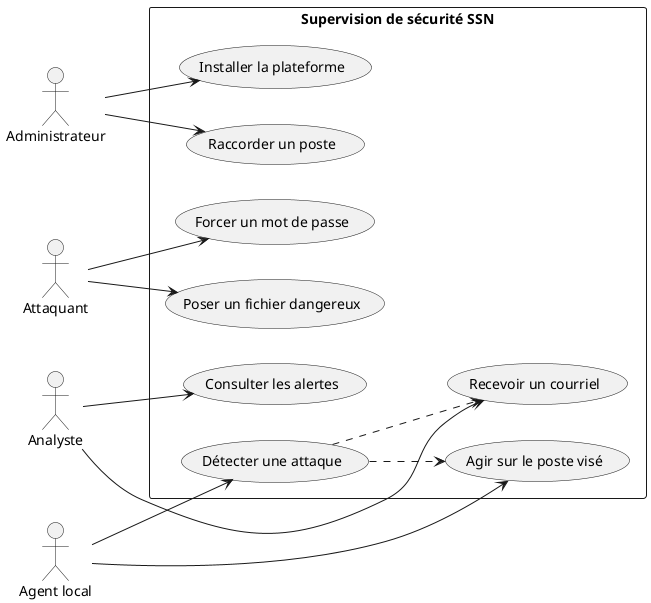
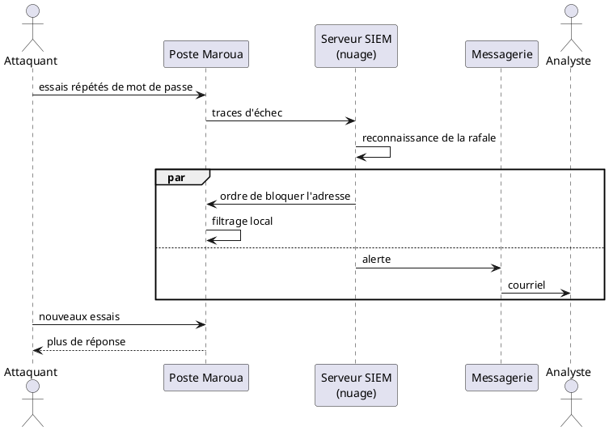
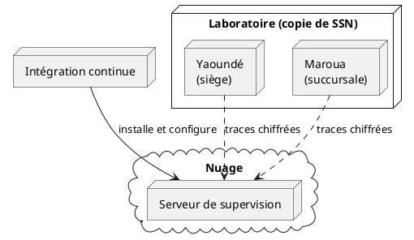

<!--
Note Word — Guide ISJ 2025 (à retirer du livrable) :
- Times New Roman 12, justifié, interligne 1,15, retrait 1 cm, marges 2,5 cm.
- Pagination bas à droite. Texte noir. Impression recto.
- Figures et tableaux centrés ; titre (et source) SOUS le visuel.
- Tableau rédigé par l’auteur : pas de source.
- Coller ce chapitre dans rapport-de-stage.docx à la place du titre vide.
- Tableaux III.1 et III.2 ; figures 3.1 à 3.5 (listes liminaires à mettre à jour).
- Extraire les diagrammes PlantUML en image avant impression.
- Les extraits de configuration longs vont en annexe A.
-->

# Chapitre 3 : Solution Proposée

## Introduction du chapitre

Le chapitre 2 a dressé un diagnostic clair. Les postes de travail de System Security Network (SSN) sont mal protégés. Ils se trouvent au siège de Yaoundé et à la succursale de Maroua. Aucun lien privé ne relie ces deux sites. Chaque machine garde ses journaux chez elle. L’équipe n’intervient que lorsqu’un utilisateur signale un problème. Une intrusion peut donc rester invisible pendant plusieurs semaines.

La même étude a déjà choisi l’orientation technique. Le cerveau de la supervision ne doit plus être une machine du siège. Il doit être dans le nuage. De petits programmes, appelés agents, restent sur les postes. Un réseau privé relie le tout. Le présent chapitre transforme cette orientation en solution concrète. C’est ici que se situe notre apport pour l’entreprise.

Un mot d’abord sur le vocabulaire. Un *Security Information and Event Management* (SIEM) est une plateforme qui rassemble les traces de sécurité, les compare et déclenche une alerte. Un agent est un logiciel léger installé sur un poste. Il envoie ces traces vers le SIEM. Une réponse active est une action automatique sur la machine visée : bloquer une adresse, supprimer un fichier, isoler le poste. Le *File Integrity Monitoring* (FIM) surveille les changements de fichiers. Le *Mean Time To Detect* (MTTD) est le délai moyen avant découverte d’un incident, exprimé en secondes ou en semaines. Le *Mean Time To Respond* (MTTR) est le délai moyen avant action corrective.

Nous retenons Wazuh comme SIEM. Ce choix s’appuie sur l’étude comparative d’Owolafe et James (2024), déjà présentée au tableau II du chapitre 2. Wazuh combine surveillance des postes, contrôle d’intégrité et réponse automatique, sans imposer une pile trop lourde.

La modélisation précède le déploiement. Le langage retenu est *Unified Modeling Language* (UML). Il permet de montrer qui agit, dans quel ordre, et sur quelles machines, sans noyer le lecteur dans le code.

Le chapitre compte deux sections. La section 1 fixe les besoins, les schémas UML et l’architecture. La section 2 décrit la mise en œuvre, puis deux essais : une attaque par mot de passe à Maroua, et une altération de fichier à Yaoundé. Dans les deux cas, la machine réagit toute seule. En même temps, un courriel prévient l’équipe.

---

## Section 1 : Analyse, modélisation et architecture de la solution

Cette section construit la solution sur le papier. Elle part des besoins de SSN. Elle les traduit en schémas. Elle décrit ensuite le réseau et le rôle de chaque composant.

### 3.1.1. Démarche retenue et cahier des charges

#### 3.1.1.1. Une sécurité pensée dès la conception

Nous n’ajoutons pas la sécurité à la fin. Nous la plaçons dans chaque étape du projet. Cinq temps s’enchaînent.

D’abord, nous planifions. Le parc de la Direction Technique est mixte : Windows, Linux, parfois macOS. Les deux villes n’ont pas de tunnel dédié. Il faut donc un serveur central accessible des deux côtés, et des agents discrets sur les postes.

Ensuite, nous décrivons l’infrastructure sous forme de texte. L’ordinateur distant, ses règles de filtrage et sa clé d’accès sont déclarés une fois pour toutes. Rien d’essentiel n’est cliqué à la main dans la console du fournisseur. On peut recréer l’ensemble. On peut aussi l’effacer proprement.

Puis un enchaînement automatique prend le relais. À chaque mise à jour validée du projet, trois contrôles se suivent : vérifier les fichiers, créer la machine distante, installer et régler le SIEM. Un opérateur n’a plus à se souvenir d’une longue liste de commandes.

Vient alors la détection. Le SIEM ne se contente pas d’afficher des graphiques. Il donne un ordre à l’agent. Bloquer l’attaquant. Enlever un fichier dangereux. Couper le poste du réseau local, tout en gardant un accès d’administration.

Enfin, un courriel part vers l’équipe. Le chapitre 2 a montré que personne ne surveille les journaux en continu. Le message électronique réveille l’humain. Il ne remplace pas l’action automatique. Il l’accompagne.

Cette boucle — prévoir, installer, détecter, agir, prévenir — fait de la sécurité une propriété du système. Elle n’est plus un contrôle extérieur, déclenché trop tard.

#### 3.1.1.2. Besoins fonctionnels

Nous traduisons le diagnostic du chapitre 2 en cinq capacités observables.

**BF-01 — Rassembler les traces.** Chaque poste doit envoyer ses journaux vers le serveur central. Connexions distantes, changements de fichiers, actions de défense : tout quitte la machine dès qu’un événement apparaît. Si un logiciel malveillant efface ensuite les fichiers locaux, la copie centrale existe déjà. C’est la réponse au cloisonnement décrit au chapitre 2.

**BF-02 — Comprendre tout de suite.** Un seul échec de mot de passe n’est pas une attaque. Une rafale d’échecs l’est. De même, un fichier ajouté dans Téléchargements n’est pas forcément un virus. Le moteur du SIEM doit relier ces faits et lever une alerte utile.

**BF-03 — Agir sans ticket.** Le chapitre 2 a montré l’absence de procédure d’incident. La machine visée doit elle-même bloquer l’adresse attaquante, supprimer un fichier reconnu dangereux, ou se couper du réseau local. L’attente d’un technicien n’est plus le premier rempart.

**BF-04 — Voir les deux sites dans un seul écran.** L’analyste ne doit pas ouvrir une session à Yaoundé et une autre à Maroua. Un tableau de bord unique présente les alertes, l’état des agents et le suivi des actions.

**BF-05 — Prévenir par courriel.** L’équipe n’intervient aujourd’hui qu’à la demande de l’utilisateur. Toute alerte grave doit donc produire un message. Ce message part en même temps que l’action automatique. Ni l’un ni l’autre n’attend.

#### 3.1.1.3. Besoins non fonctionnels

Quatre qualités encadrent la solution.

Le lien entre les postes et le serveur central doit être chiffré. Il ne passe pas par Internet en clair. C’est le rôle d’un réseau privé maillé.

L’agent doit rester léger. Les postes du laboratoire n’ont pas les ressources d’un grand serveur. On surveille surtout les dossiers utiles, pas toute la machine avec des modules lourds.

Le serveur central doit survivre à une panne du siège. Une coupure d’électricité à Yaoundé ne doit plus aveugler Maroua. D’où le choix du nuage pour le cerveau, et des postes pour les agents.

Enfin, le déploiement doit être reproductible. Les mots de passe et les clés ne figurent pas dans le dossier partagé. Ils restent dans un coffre du service d’intégration continue.

Le tableau III.1 relie chaque besoin à sa réponse. Il ne s’agit pas d’une liste d’outils. C’est la traduction, en capacités, du diagnostic du chapitre 2. Si l’un de ces besoins restait vide, le problème des postes isolés ne serait que déplacé, non résolu.

Le tableau III.1 relie chaque besoin à sa réponse.

```
+--------+----------------------------------+-------------------------------------------+
| Code   | Ce que SSN doit obtenir          | Comment la solution y répond              |
+--------+----------------------------------+-------------------------------------------+
| BF-01  | Traces centralisées              | Agents locaux, serveur dans le nuage      |
| BF-02  | Alerte dès que le motif est clair| Corrélation Wazuh (force brute, FIM)      |
| BF-03  | Action sans attendre l’humain    | Blocage, suppression, isolement           |
| BF-04  | Vue unique des deux sites        | Tableau de bord Wazuh                     |
| BF-05  | Réveil de l’équipe               | Courriel automatique                      |
| BNF-01 | Lien privé et chiffré            | Réseau maillé Tailscale                   |
| BNF-02 | Agent discret                    | Surveillance ciblée des dossiers           |
| BNF-03 | Indépendance vis-à-vis du siège  | Serveur central dans le nuage             |
| BNF-04 | Reproductibilité, secrets protégés| Déploiement automatisé, coffre de secrets|
+--------+----------------------------------+-------------------------------------------+
```

**Tableau III.1 :** Correspondance entre les besoins de SSN et la solution proposée

---

### 3.1.2. Démarche de modélisation et langage UML

Le Guide de l’Institut Saint Jean (ISJ) demande d’indiquer la méthode et le langage de modélisation. Notre démarche est descendante. Nous partons des personnes et de leurs actions. Nous ordonnons ensuite les messages dans le temps. Nous plaçons enfin chaque composant sur une machine.

Le langage est UML. C’est un dessin normalisé. Il se lit sans connaître les outils d’installation. Trois vues suffisent.

La première répond à la question : qui fait quoi ? La deuxième : dans quel ordre les messages circulent-ils ? La troisième : où chaque pièce s’exécute-t-elle ?

#### 3.1.2.1. Diagramme de cas d’utilisation

Quatre acteurs apparaissent. L’administrateur installe et maintient la plateforme. L’analyste consulte le tableau de bord et lit les courriels. L’agent local collecte les traces et exécute les ordres de défense. L’attaquant fournit les stimuli : force brute ou fichier dangereux.



**Figure 3.0a :** Acteurs et cas d’utilisation de la solution  
**Source :** Nos travaux, modélisation UML (2026)

Le point important est le double départ, depuis la détection : une action sur le poste, et un courriel vers l’analyste. L’un n’attend pas l’autre.

#### 3.1.2.2. Diagramme de séquence d’une force brute

Le schéma suivant raconte une attaque par dictionnaire contre un poste de Maroua. L’attaquant multiplie les essais de mot de passe. L’agent envoie les échecs au serveur. Le serveur reconnaît la rafale. Il ordonne le blocage. En parallèle, il fait partir un courriel.



**Figure 3.0b :** Enchaînement d’une détection de force brute, d’un blocage et d’un courriel  
**Source :** Nos travaux, modélisation UML (2026)

Le message électronique n’arrive pas « après coup ». Il part pendant que le poste se protège. L’analyste n’a pas besoin d’avoir l’écran ouvert pour être informé.

#### 3.1.2.3. Diagramme de déploiement

Le dernier schéma situe les pièces. À gauche, le service d’intégration continue déclenche l’installation. Au centre, une machine dans le nuage porte le SIEM, le tableau de bord et la messagerie interne. À droite, les deux sites de SSN, reproduits en laboratoire, portent les agents. Le réseau privé relie le nuage et les postes.



**Figure 3.0c :** Placement des composants entre le nuage et les deux sites  
**Source :** Nos travaux, modélisation UML (2026)

Les postes n’exposent pas le SIEM sur Internet. Ils ne parlent qu’à travers le réseau privé. Le détail des fichiers de configuration figure en annexe A.

---

### 3.1.3. Architecture technique, expliquée à partir du terrain

#### 3.1.3.1. Deux villes, deux réseaux, un laboratoire

Le chapitre 2 a décrit le parc réel. Yaoundé d’un côté. Maroua de l’autre. Deux réseaux locaux autonomes. Chacun sort vers Internet de son côté. Aucun tunnel d’entreprise ne les relie.

Le laboratoire de la Direction Technique recopie cette situation. Un premier réseau local représente le siège. Un second représente la succursale. Aucune route privée n’est ajoutée entre eux. Les postes y portent un agent. Cette copie n’est pas un jeu. Elle oblige la solution à vivre avec la distance, comme SSN la vit chaque jour.

```
                    Serveur de supervision
                         (nuage)
                           |
                    réseau privé chiffré
                     /              \
            Siège Yaoundé      Succursale Maroua
            (SITE-1, Windows)  (SITE-2, Linux)
            dossier Téléchargements   dossier Téléchargements
```

```
+-----------------------------------------------------------------------------------+
|             [ ZONE D'INSERTION : TOPOLOGIE RÉSEAU MULTI-SITES ]                   |
+-----------------------------------------------------------------------------------+
```

**Figure 3.1 :** Reproduction du siège et de la succursale, reliés au serveur par un réseau privé  
**Source :** Nos travaux de laboratoire, d’après le diagnostic du chapitre 2 (2026)

Les groupes d’agents suivent la carte de SSN. Le groupe du siège surveille le dossier Téléchargements Windows. Le groupe de la succursale surveille le dossier équivalent sous Linux. C’est souvent par ce dossier qu’entre un fichier dangereux, comme le chapitre 2 l’a rappelé. Wazuh sait aussi parler à macOS. Notre banc se limite à Windows et Linux, plus nombreux dans le parc observé.

#### 3.1.3.2. Le lien privé qui manquait

Le vrai apport réseau n’est pas un nouveau pare-feu de site. C’est le lien qui n’existait pas. Tailscale crée un petit réseau commun. Chaque machine reçoit une adresse interne. Les journaux y circulent chiffrés. Yaoundé et Maroua restent autonomes pour le travail quotidien. Ils partagent seulement un chemin sûr vers le serveur de supervision.

Deux conséquences suivent. Premièrement, le serveur d’alertes n’écoute pas sur Internet. Un inconnu ne peut pas s’y enregistrer comme s’il était un poste de SSN. Deuxièmement, une panne électrique au siège n’éteint plus la vue sur Maroua. Le cerveau est dans le nuage. Le chapitre 2 avait nommé ce risque. La solution le traite.

L’analyste ouvre le tableau de bord par ce même lien privé. L’écran d’administration n’est pas public.

#### 3.1.3.3. Le serveur de supervision et le courriel

La machine distante rassemble trois rôles. Elle reçoit les traces. Elle les range. Elle les affiche. Un service de messagerie local complète le dispositif. Le SIEM ne parle pas directement à Internet pour envoyer un mail. Il dépose le message chez un relais interne. Ce relais, une fois authentifié, l’achemine vers la boîte de l’équipe.

Le seuil retenu envoie un courriel dès qu’un incident devient sérieux. Une attaque par mot de passe entre dans ce cas. Un fichier jugé malveillant aussi. Un changement dans Téléchargements prévient également, afin que l’enrichissement antivirus ne reste pas silencieux. Les confirmations d’action (poste bloqué, agent coupé) partent elles aussi. L’équipe suit ainsi le début et la fin de l’incident.

---

### 3.1.4. Organisation du travail et du dépôt de code

Le projet vit dans un dépôt nommé `wazuh-cloud-deployment-pipeline`. Trois dossiers suffisent à le comprendre.

Le premier décrit la machine distante : taille, disque, règles d’accès. Le deuxième décrit ce que l’on installe dessus : SIEM, messagerie, réseau privé, règles de détection, scripts de défense. Le troisième décrit l’enchaînement automatique qui, à chaque validation, vérifie, crée, puis configure.

Nous ne reproduisons pas ici les fichiers complets. Ils alourdiraient la lecture. On se référera, pour le détail, à l’annexe A. L’idée à retenir est simple. Rien de sensible n’est écrit en clair dans le dossier. Les identifiants passent par un coffre. L’inventaire des machines est produit au moment de la création, puis transmis à l’étape de configuration.

Sur les postes, l’agent pointe vers l’adresse privée du serveur, pas vers son adresse publique. Le serveur pousse ensuite, à chaque groupe, la liste des dossiers à surveiller. Yaoundé et Maroua reçoivent donc des consignes adaptées, sans visite sur chaque bureau.

---

## Section 2 : Mise en œuvre, essais et enseignements

Cette section quitte le papier. Elle montre comment la plateforme s’installe, puis comment elle se comporte face aux deux menaces du chapitre 2.

### 3.2.1. Du projet validé à la plateforme prête

Un enchaînement unique suffit. Il a trois temps.

Le premier temps contrôle. Les descriptions d’infrastructure et de configuration sont-elles cohérentes ? Si non, on s’arrête. On ne crée pas de machine sur une base fautive.

Le deuxième temps crée, dans le nuage, l’ordinateur de supervision et ses règles d’accès. Il en tire l’adresse nécessaire à l’étape suivante.

Le troisième temps installe le SIEM, règle la messagerie, ouvre le réseau privé, pose les règles de détection et les scripts de défense. Si le SIEM est déjà présent, on ne le réinstalle pas. On met seulement à jour ce qui a changé. Le travail peut donc se répéter sans tout casser.

Reste le raccordement des postes. Il se fait au laboratoire, sur les copies de Yaoundé et de Maroua. Chaque agent rejoint son groupe. Un courriel peut déjà signaler qu’un agent s’est connecté ou qu’il a disparu. Avant les essais, nous vérifions cinq points simples : les machines se voient sur le réseau privé ; les deux agents sont actifs ; la file de messagerie est vide ; aucun refus d’envoi n’apparaît ; un message de test arrive bien dans la boîte de l’équipe.

```
+-----------------------------------------------------------------------------------+
|             [ ZONE D'INSERTION : DÉROULEMENT DE L'INSTALLATION AUTOMATISÉE ]      |
+-----------------------------------------------------------------------------------+
```

**Figure 3.2 :** Enchaînement automatique de l’installation  
**Source :** Dépôt du projet de stage (2026)

La première installation dure plus longtemps. C’est normal : le SIEM s’installe en entier. Les fois suivantes vont plus vite. On ne refait que les réglages.

---

### 3.2.2. Premier essai : une attaque par mot de passe à Maroua

Le chapitre 2 nommait deux portes d’entrée : la connexion distante en ligne de commande, et le bureau à distance Windows. Nous éprouvons la première sur un poste Linux de Maroua. Sur un poste Windows du siège, le pare-feu local joue le même rôle de barrage.

#### 3.2.2.1. Comment l’essai est conduit

L’attaquant n’appartient pas au réseau privé de SSN. Il se place hors du réseau de Maroua. Il lance un outil qui essaie, l’un après l’autre, des mots de passe tirés d’une liste courte, constituée pour le laboratoire. Chaque échec s’écrit sur le poste. L’agent envoie ces lignes au serveur, par le lien chiffré.

#### 3.2.2.2. Ce que le SIEM comprend, et ce que l’équipe reçoit

Un échec isolé n’alarme personne. Une série d’échecs, si. Le moteur reconnaît la rafale. Il lève une alerte grave. Un courriel part alors vers l’équipe. Il dit quelle machine est visée, depuis quelle adresse, et de quel type d’attaque il s’agit. Un second message suit lorsque le blocage est confirmé. L’analyste tient ainsi le début et la fin de l’histoire, même s’il n’a pas l’écran sous les yeux.

#### 3.2.2.3. Ce que le poste fait tout seul

Dès que la rafale est reconnue, le serveur donne un ordre au poste visé. Le poste bloque l’adresse de l’attaquant pendant une heure. Les essais suivants n’obtiennent plus de réponse. Sous Windows, le pare-feu du poste joue le même rôle.

Nous vérifions le résultat de quatre manières. L’écran de supervision montre l’alerte et la confirmation. Le journal de l’agent consigne l’action. La liste de filtrage du poste contient bien l’adresse bloquée. La boîte mail de l’équipe contient les deux messages. L’outil d’attaque cesse d’avancer.

```
+-----------------------------------------------------------------------------------+
|             [ ZONE D'INSERTION : ALERTE DE FORCE BRUTE ET COURRIEL ]              |
+-----------------------------------------------------------------------------------+
```

**Figure 3.3 :** Détection d’une attaque par mot de passe et blocage automatique  
**Source :** Console de supervision (2026)

Le délai avant détection se compte en secondes, le temps que la rafale soit reconnue. Le délai avant blocage reste inférieur à une minute. Ces temps ne dépendent plus de la présence d’un technicien.

---

### 3.2.3. Second essai : un fichier modifié ou un logiciel dangereux

Le chapitre 2 décrivait un second scénario. Un fichier malveillant arrive, souvent par téléchargement. Il change des dossiers. Rien ne le voit. Il s’exécute. Parfois, il efface les traces. Nous éprouvons ici deux gestes. L’un touche un programme système. L’autre dépose un fichier dans Téléchargements.

#### 3.2.3.1. Comment l’essai est conduit

Au siège, nous altérons, de façon contrôlée, un programme d’ouverture de session. Le contrôle d’intégrité recalcule l’empreinte du fichier. Le changement remonte au serveur. C’est un signal grave : la confiance dans le poste s’effondre.

Nous déposons ensuite un fichier dans Téléchargements, à Yaoundé puis à Maroua. Chaque site a sa propre consigne. Le SIEM voit l’ajout ou la modification. Il interroge un service d’analyse d’empreintes. Si plusieurs moteurs s’accordent pour dire que le fichier est dangereux, une alerte plus forte s’élève.

#### 3.2.3.2. Ce que l’équipe apprend par courriel

Le message décrit le chemin du fichier, l’ancienne et la nouvelle empreinte, la machine concernée. Il part pendant que le poste agit. L’analyste n’a pas besoin d’ouvrir l’écran pour savoir qu’un téléchargement vient d’être jugé dangereux, ou qu’un programme système a changé. Un dernier courriel dit si la suppression a réussi ou échoué.

#### 3.2.3.3. Deux réponses, selon la gravité

Si le fichier de Téléchargements est reconnu dangereux, l’agent l’efface. Sous Windows, le même principe s’applique, avec des précautions pour ne pas suivre un faux chemin. Le ticket de dépannage n’est plus le premier geste.

Si c’est un programme d’ouverture de session qui a changé, effacer un fichier ne suffit plus. Le poste peut servir de tremplin vers le reste du réseau. Nous demandons alors un isolement. Le poste cesse de parler à ses voisins. Il garde toutefois le lien privé d’administration. L’analyste peut encore l’interroger. Il ne peut plus se propager. C’est exactement l’isolement qui manquait au chapitre 2.

```
+-----------------------------------------------------------------------------------+
|             [ ZONE D'INSERTION : ALERTE D'INTÉGRITÉ ET ISOLEMENT ]                |
+-----------------------------------------------------------------------------------+
```

**Figure 3.4 :** Alerte d’intégrité et mise à l’écart du poste compromis  
**Source :** Console de supervision (2026)

---

### 3.2.4. Ce que change la solution pour SSN

Les deux sites apparaissent désormais dans un seul écran. Les attaques du diagnostic reçoivent une réponse. L’équipe est prévenue sans attendre un appel.

```
+-----------------------------------------------------------------------------------+
|             [ ZONE D'INSERTION : VUE D'ENSEMBLE DU TABLEAU DE BORD ]              |
+-----------------------------------------------------------------------------------+
```

**Figure 3.5 :** Vue d’ensemble de la supervision des deux sites  
**Source :** Console de supervision (2026)

Le tableau III.2 place côte à côte le constat du chapitre 2 et le résultat du chapitre 3.

```
+------------------------------+-------------------------------+------------------------------+
| Point observé                | Avant (chapitre 2)            | Après (chapitre 3)           |
+------------------------------+-------------------------------+------------------------------+
| Lien Yaoundé – Maroua        | Aucun lien privé              | Réseau privé chiffré         |
| Journaux                     | Restent sur chaque poste      | Copiés vers le serveur       |
| Attaque par mot de passe     | Pas d’alerte, pas de blocage  | Détection et blocage rapides |
| Fichier dangereux            | Invisible plusieurs semaines  | Vu tout de suite, puis ôté   |
| Poste infecté                | Reste dans le réseau          | Isolé, accès d’admin gardé   |
| Intervention                 | À la demande de l’utilisateur | Action auto et courriel      |
| Installation du SIEM         | Longue, manuelle              | Reproductible, automatisée   |
| Panne au siège               | Aveugle aussi Maroua          | Le cerveau reste dans le nuage|
+------------------------------+-------------------------------+------------------------------+
```

**Tableau III.2 :** Comparaison entre le diagnostic du chapitre 2 et la solution mise en œuvre

Les délais se mesurent simplement. Le MTTD court du premier essai de mot de passe, ou du premier changement de fichier, jusqu’à l’apparition de l’alerte. Le MTTR court de cette alerte jusqu’à l’effet visible : adresse bloquée, fichier absent, poste injoignable sur le réseau local. Le courriel n’accélère pas, à lui seul, la détection technique. Il accélère l’information de l’humain. Sans lui, une défense silencieuse laisserait l’équipe dans l’ignorance.

Pour SSN, le premier gain est interne. Le parc de la Direction Technique, décrit au chapitre 1, n’est plus un ensemble de machines isolées. Le second gain est commercial. L’entreprise vend déjà l’audit, le test d’intrusion et la corrélation d’événements. Le même enchaînement peut être montré à un client, puis adapté, sans tout réécrire. Le laboratoire sert de démonstration, sans exposer le système d’un tiers.

Des limites demeurent. Un seul serveur rassemble aujourd’hui tous les rôles. Une panne de cette machine arrêterait la vue. L’accès d’installation depuis le service automatique reste volontairement large, car les adresses de ce service changent. L’enregistrement d’un agent ne demande pas encore un mot de passe. Ces points relèvent d’un travail ultérieur. Ils n’effacent pas le résultat obtenu sur le banc d’essai.

---

## Conclusion du chapitre 3

Nous avons proposé une solution adaptée au problème de SSN. Le cerveau de la supervision est dans le nuage. Les agents restent sur les postes de Yaoundé et de Maroua. Un réseau privé fournit le lien qui manquait. Les postes se défendent seuls. L’équipe est prévenue par courriel.

La section 1 a fixé les besoins et les schémas. La section 2 a montré que la plateforme s’installe de façon répétée, qu’une attaque par mot de passe à Maroua est stoppée, et qu’un fichier dangereux à Yaoundé est vu, signalé, puis traité.

Le MTTD ne se compte plus en semaines. Le MTTR ne dépend plus d’un ticket. La conclusion générale reviendra sur le bilan du stage et sur les pistes d’amélioration. Pour les fichiers de configuration, on se référera à l’annexe A.
