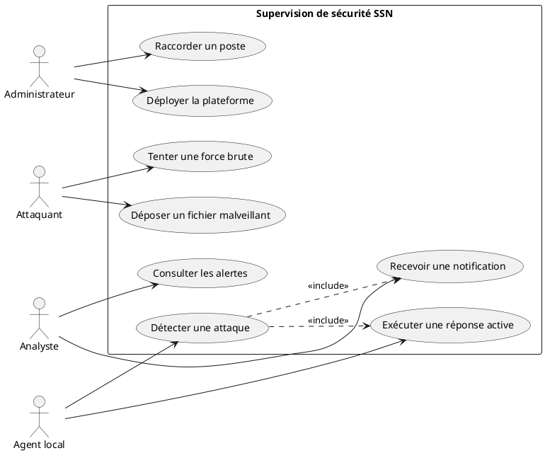
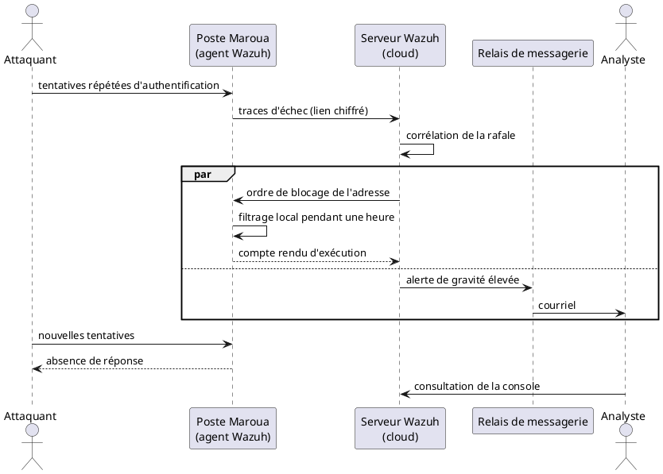
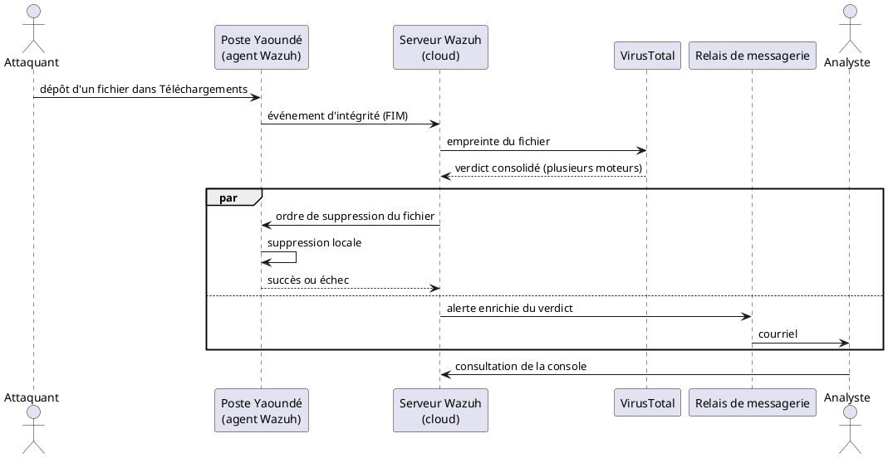
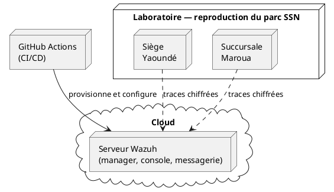

<!--
Note Word — Guide ISJ 2025 (retirer avant impression) :
- Times New Roman 12, justifié, interligne 1,15, retrait 1 cm, marges 2,5 cm.
- Pagination bas à droite. Texte noir. Recto uniquement.
- Titre et source SOUS chaque figure. Tableau d’auteur : pas de source.
- Volume du chapitre 3 (Ingé 4) : 12 pages.
- Coller dans rapport-de-stage.docx à la place du titre vide du chapitre 3.
- Tableaux III.1 et III.2. Figures 3.1 à 3.11, plus 3.0a à 3.0d (UML).
- Quatre cadres COURRIEL (fig. 3.4, 3.5, 3.7, 3.8) et cinq cadres INTERFACE
  WAZUH DASHBOARD (fig. 3.3, 3.6, 3.9, 3.10, 3.11), hauteur ~7 cm, centrés.
- Arbitrage des 12 pages, dans cet ordre : réduire les captures à 6 cm, puis
  déplacer les figures 3.5, 3.8 et 3.10 en annexe B (les renvois sont déjà rédigés).
- Exporter les PlantUML en PNG. Fichiers de configuration : annexe A.
- Abréviations à ajouter en page liminaire : VT (VirusTotal), IaC, CI/CD.
-->

# Chapitre 3 : Solution Proposée

## Introduction du chapitre

Le chapitre 2 a établi un diagnostic sans ambiguïté. Les postes de travail de System Security Network (SSN), répartis entre le siège de Yaoundé et la succursale de Maroua, constituent aujourd’hui la surface d’attaque la plus exposée de l’entreprise. Aucune liaison privée ne relie les deux implantations, chaque machine conserve ses journaux sur son propre disque, et l’équipe technique n’intervient qu’à la demande de l’utilisateur. Une intrusion discrète peut donc demeurer active plusieurs semaines.

Ce même diagnostic a dégagé une orientation. Le serveur central de supervision doit quitter les équipements locaux du siège pour rejoindre le cloud, tandis que des agents légers demeurent installés sur les postes. Une liaison privée chiffrée relie ensuite ces deux mondes. Le présent chapitre transforme cette orientation en dispositif opérationnel, éprouvé sur un banc d’essai. C’est à ce niveau que se situe notre apport pour l’entreprise.

Quelques notions méritent d’être posées avant d’entrer dans la conception. Un *Security Information and Event Management* (SIEM) centralise les journaux de sécurité, les corrèle et produit des alertes hiérarchisées. Un agent désigne le logiciel installé sur le poste surveillé : il collecte les traces et exécute les ordres reçus. Une réponse active (*Active Response*) est l’action automatique déclenchée sur la machine visée, qu’il s’agisse de bloquer une adresse, de supprimer un fichier ou d’isoler l’hôte. Le contrôle d’intégrité des fichiers (*File Integrity Monitoring*, FIM) signale toute modification d’un fichier surveillé. VirusTotal, enfin, est un service d’analyse en ligne qui confronte l’empreinte d’un fichier à plusieurs dizaines de moteurs antivirus et retourne un verdict consolidé.

Nous retenons Wazuh comme SIEM, conformément à l’étude d’Owolafe et James (2024) présentée au tableau II. Cette plateforme réunit dans un même produit la surveillance des postes, le contrôle d’intégrité et la réponse active, pour une consommation de ressources maîtrisée. La conception précède l’installation : nous employons le langage *Unified Modeling Language* (UML), qui décrit les acteurs, la chronologie des échanges et la répartition des composants sans imposer la lecture du code.

Deux sections structurent ce chapitre, selon le canevas du Guide de l’Institut Saint Jean (ISJ). La première analyse les besoins, les modélise et présente l’architecture retenue. La seconde décrit le déploiement automatisé, puis deux expérimentations directement issues du diagnostic : une attaque par force brute contre un poste de Maroua, puis l’altération d’un fichier au siège. Dans les deux cas, la machine visée réagit d’elle-même pendant qu’un courriel alerte l’équipe.

---

## Section 1 : Analyse, modélisation et architecture de la solution

Cette première section construit la solution avant toute installation. Elle part des besoins de SSN, les traduit en modèles UML, puis décrit l’architecture réseau et le rôle de chaque composant.

### 3.1.1. Démarche d’ingénierie et cahier des charges

#### 3.1.1.1. Une sécurité intégrée au cycle de vie du projet

La démarche retenue relève du DevSecOps, c’est-à-dire de l’intégration de la sécurité à chaque étape du cycle de vie, plutôt que de son ajout en fin de parcours. Cinq phases s’enchaînent et se répondent.

La planification part du terrain. Le parc de la Direction Technique associe des postes Windows, Linux et, plus rarement, macOS, répartis sur deux sites dépourvus de tunnel dédié. Cette hétérogénéité impose un serveur central joignable depuis les deux villes, ainsi que des agents assez discrets pour ne pas pénaliser des machines de bureau.

L’infrastructure est ensuite décrite sous forme de code (*Infrastructure as Code*, IaC). Terraform déclare, dans un fichier versionné, la machine virtuelle de supervision, son disque, ses règles de filtrage et sa clé d’accès. Aucune ressource essentielle n’est créée manuellement, ce qui garantit une reconstruction identique et une suppression propre.

L’intégration et le déploiement continus (*Continuous Integration / Continuous Deployment*, CI/CD) prennent alors le relais. À chaque modification validée du dépôt, GitHub Actions vérifie la cohérence des fichiers, provisionne la machine, puis lance Ansible qui installe et configure Wazuh. La procédure ne varie donc pas d’une exécution à l’autre.

Vient la détection. Wazuh ne se contente pas d’afficher des tableaux de bord : il transmet un ordre à l’agent concerné, qu’il s’agisse de bloquer l’adresse d’un attaquant, de supprimer un fichier malveillant ou d’isoler le poste tout en préservant l’accès d’administration.

La notification clôt la boucle. Le chapitre 2 a montré que personne, chez SSN, ne consulte les journaux en continu. Un courriel informe donc l’équipe au moment même où la réponse active s’exécute. Il ne remplace pas l’action automatique ; il la rend visible.

#### 3.1.1.2. Besoins fonctionnels

Nous traduisons le diagnostic en cinq besoins fonctionnels, chacun correspondant à une capacité observable sur la plateforme déployée.

**BF-01 — Centraliser les journaux.** Chaque poste doit transmettre au serveur central ses traces d’authentification, ses événements d’intégrité et ses comptes rendus de réponse active. Les données quittent la machine dès l’événement, de sorte qu’un logiciel malveillant effaçant ensuite les journaux locaux ne supprime plus la copie déjà exportée. Ce besoin répond directement au cloisonnement décrit au chapitre 2.

**BF-02 — Corréler en temps réel.** Un échec d’authentification isolé ne constitue pas une attaque, alors qu’une rafale d’échecs en provenance de la même adresse en constitue une. De même, un fichier déposé dans le dossier Téléchargements n’est pas nécessairement malveillant. Le moteur de corrélation doit donc relier ces événements et ne produire une alerte que lorsque le motif devient significatif.

**BF-03 — Répondre sans intervention humaine.** En l’absence de procédure formalisée de réponse aux incidents, la machine visée doit agir seule : bloquer l’adresse de l’attaquant, supprimer le fichier reconnu dangereux, ou se retirer du réseau local. L’intervention du technicien cesse d’être le premier rempart pour devenir une étape d’investigation.

**BF-04 — Unifier la visualisation.** L’analyste ne doit plus ouvrir une session distincte pour Yaoundé et pour Maroua. Une console unique doit présenter les alertes des deux sites, l’état des agents et le suivi des réponses actives.

**BF-05 — Notifier par courriel.** Toute alerte de gravité élevée doit produire un message électronique à destination de l’équipe. Ce courriel part simultanément à la réponse active : le confinement ne retarde pas la notification, et la notification ne retarde pas le confinement.

#### 3.1.1.3. Besoins non fonctionnels

Quatre exigences de qualité encadrent la solution.

Le trafic échangé entre les agents et le serveur central doit être chiffré de bout en bout, sans transiter en clair par Internet. Un réseau privé maillé assure cette protection.

L’agent doit rester léger, car il s’exécute sur des postes de bureau aux ressources limitées. Nous restreignons donc la surveillance temps réel aux répertoires réellement exposés, sans activer les modules d’audit les plus coûteux.

Le serveur central doit survivre à une défaillance du siège. Une coupure électrique à Yaoundé ne doit plus priver l’entreprise de toute visibilité sur Maroua, ce qui justifie son hébergement dans le cloud.

Le déploiement, enfin, doit être reproductible et exempt de secrets en clair. Les identifiants, clés et jetons d’authentification résident exclusivement dans le coffre de secrets du service d’intégration continue, jamais dans le dépôt de code.

Le tableau III.1 récapitule cette traçabilité. Il ne s’agit pas d’un catalogue d’outils, mais de la traduction du diagnostic en capacités vérifiables : tout besoin laissé sans réponse déplacerait le problème sans le résoudre.

```
+--------+-------------------------------------+------------------------------------------+
| Code   | Capacité attendue                   | Mécanisme retenu                         |
+--------+-------------------------------------+------------------------------------------+
| BF-01  | Journaux centralisés                | Agents locaux, serveur Wazuh dans le cloud|
| BF-02  | Corrélation en temps réel           | Moteur de règles, puis analyse VirusTotal |
| BF-03  | Réponse sans intervention humaine   | Blocage, suppression, isolement de l'hôte |
| BF-04  | Visualisation unifiée des deux sites| Console Wazuh Dashboard                   |
| BF-05  | Notification de l'équipe            | Relais de messagerie et courriel          |
| BNF-01 | Trafic chiffré entre sites          | Réseau privé maillé Tailscale (WireGuard) |
| BNF-02 | Agent léger sur les postes          | Surveillance ciblée des répertoires       |
| BNF-03 | Indépendance vis-à-vis du siège     | Hébergement du serveur dans le cloud      |
| BNF-04 | Reproductibilité, secrets protégés  | Terraform, Ansible, coffre de secrets     |
+--------+-------------------------------------+------------------------------------------+
```

**Tableau III.1 :** Traçabilité des besoins de SSN vers les mécanismes de la solution

---

### 3.1.2. Démarche de modélisation et langage UML

Le Guide ISJ demande d’expliciter la méthode et le langage de modélisation. Notre démarche procède par raffinements successifs : nous identifions d’abord les acteurs et leurs actions, nous ordonnons ensuite les échanges dans le temps, puis nous situons chaque composant sur une machine physique ou virtuelle.

Le langage retenu est UML, dont la notation normalisée permet au jury comme à l’entreprise de lire l’architecture sans parcourir les fichiers de configuration. Quatre vues suffisent à couvrir la solution : un diagramme de cas d’utilisation, deux diagrammes de séquence — l’un pour la force brute, l’autre pour le fichier malveillant — et un diagramme de déploiement.

#### 3.1.2.1. Diagramme de cas d’utilisation

Quatre acteurs interviennent. L’administrateur déploie et maintient la plateforme. L’analyste consulte la console et reçoit les alertes. L’agent local collecte les traces et applique les ordres de défense. L’attaquant, enfin, produit les stimuli que sont la force brute et le dépôt d’un fichier malveillant.



**Figure 3.0a :** Acteurs et cas d’utilisation de la plateforme de supervision  
**Source :** Nos travaux, modélisation UML (2026)

Les deux relations d’inclusion issues de la détection traduisent l’exigence centrale du cahier des charges : une même alerte déclenche simultanément la réponse active et la notification de l’analyste.

#### 3.1.2.2. Diagramme de séquence : détection d’une attaque par force brute

Ce diagramme décrit, dans l’ordre chronologique, ce que le chapitre 2 présentait comme impossible : reconnaître une rafale de tentatives, bloquer l’adresse fautive et prévenir l’équipe, le tout sans intervention humaine. L’attaquant cible un poste de Maroua, l’agent transmet les échecs, le serveur les corrèle, puis déclenche en parallèle le filtrage et l’alerte.



**Figure 3.0b :** Diagramme de séquence d’une attaque par force brute, avec blocage local et notification parallèle  
**Source :** Nos travaux, modélisation UML (2026)

La lecture verticale du schéma met en évidence le point d’articulation. Jusqu’à la corrélation, le flux reste ascendant : le poste subit, l’agent transmet, le serveur analyse. À partir de l’alerte, deux flux descendent simultanément, ce qu’exprime le fragment parallèle. Le premier ordonne le blocage, le second alimente la messagerie. Le courriel ne constitue donc pas un compte rendu différé : il voyage pendant que le poste se protège. L’analyste qui ouvre ensuite la console ne fait que confirmer une information déjà reçue. L’expérimentation de la section 2 rejoue cette séquence à l’identique.

#### 3.1.2.3. Diagramme de séquence : détection d’un fichier malveillant

Le second diagramme traite l’autre menace du diagnostic, celle du fichier téléchargé qui modifie le système sans être repéré. Le contrôle d’intégrité constate ici qu’un fichier a changé, mais il ne se prononce pas sur sa dangerosité : cette qualification revient à VirusTotal. Le serveur lui transmet l’empreinte du fichier, non le fichier lui-même, et n’ordonne la suppression qu’après un verdict défavorable.



**Figure 3.0c :** Diagramme de séquence d’une détection de logiciel malveillant fondée sur VirusTotal  
**Source :** Nos travaux, modélisation UML (2026)

La structure reprend celle du schéma précédent, avec une étape supplémentaire : l’interrogation de VirusTotal. Cette étape est déterminante, car elle sépare le simple changement de fichier de la menace avérée. Sans elle, tout téléchargement déclencherait la même alerte et la suppression automatique deviendrait inacceptable pour les utilisateurs. Avec elle, l’effacement ne survient qu’après convergence de plusieurs moteurs d’analyse, et le courriel parvient à l’analyste déjà enrichi de ce verdict.

Lorsque la modification touche un exécutable système plutôt qu’un simple téléchargement, la suppression du fichier ne suffit plus, car la confiance accordée au poste s’effondre. Le schéma demeure valable, mais l’ordre redescendu isole alors la machine du réseau local, tout en maintenant le canal privé d’administration.

#### 3.1.2.4. Diagramme de déploiement

Le dernier schéma répartit les composants. GitHub Actions déclenche l’installation, la machine hébergée dans le cloud porte Wazuh, la console et le relais de messagerie, tandis que les deux sites reproduits en laboratoire hébergent les agents. Le réseau privé relie ces éléments.



**Figure 3.0d :** Répartition des composants entre le cloud et les deux sites  
**Source :** Nos travaux, modélisation UML (2026)

Les postes n’exposent aucun service de supervision sur Internet : ils dialoguent uniquement à travers le réseau privé. Les fichiers de configuration correspondants figurent en annexe A.

---

### 3.1.3. Architecture technique

#### 3.1.3.1. Reproduction de la topologie multi-sites

Le chapitre 2 a décrit un parc réparti entre deux réseaux locaux autonomes, chacun raccordé séparément à Internet et dépourvu de tunnel d’entreprise. Le laboratoire de la Direction Technique reproduit fidèlement cette configuration : un premier réseau représente le siège, un second la succursale, et aucune route privée ne les relie. Cette reproduction n’a rien d’un exercice théorique, puisqu’elle contraint la solution à fonctionner malgré la distance, la translation d’adresses et les coupures, exactement comme SSN les subit au quotidien.

```
+-----------------------------------------------------------------------------------+
|                                                                                   |
|     [ ZONE D'INSERTION : TOPOLOGIE RÉSEAU MULTI-SITES ]                           |
|     Coller ici le schéma du laboratoire (siège, succursale, serveur cloud).       |
|     Hauteur conseillée : 7 cm. Centrer l'image.                                   |
|                                                                                   |
+-----------------------------------------------------------------------------------+
```

**Figure 3.1 :** Reproduction du siège et de la succursale, reliés au serveur par un réseau privé  
**Source :** Nos travaux de laboratoire, d’après le diagnostic du chapitre 2 (2026)

Les groupes d’agents épousent l’organisation territoriale de l’entreprise. Le groupe rattaché au siège surveille en temps réel le dossier Téléchargements des postes Windows, celui de la succursale le répertoire équivalent sous Linux. Ce choix n’est pas arbitraire : le chapitre 2 a identifié le téléchargement comme la principale voie d’entrée des fichiers malveillants. Wazuh prend également en charge macOS, mais notre banc d’essai se limite aux deux systèmes majoritaires dans le parc observé.

#### 3.1.3.2. Le réseau privé, chaînon manquant de l’architecture

L’apport réseau déterminant ne réside pas dans un nouveau pare-feu périmétrique, mais dans la liaison qui faisait défaut. Tailscale constitue un réseau privé maillé, fondé sur le protocole WireGuard, au sein duquel chaque machine reçoit une adresse interne. Les journaux y circulent chiffrés de bout en bout. Yaoundé et Maroua conservent leur autonomie pour le trafic quotidien et ne partagent qu’un chemin sécurisé vers le serveur de supervision.

Deux conséquences en découlent. D’une part, les ports d’ingestion du serveur n’écoutent pas sur Internet, ce qui interdit à un tiers de se déclarer agent de SSN. D’autre part, une coupure au siège ne prive plus l’entreprise de visibilité sur la succursale, puisque le serveur réside dans le cloud : le risque identifié au chapitre 2 se trouve ainsi traité.

L’analyste accède à la console Wazuh Dashboard par cette même liaison privée, l’interface d’administration n’étant jamais exposée publiquement. Les captures de cette console figurent en section 2 (figures 3.3, 3.6, 3.9, 3.10 et 3.11).

#### 3.1.3.3. Serveur de supervision et chaîne de notification

La machine hébergée dans le cloud assume trois fonctions : elle reçoit les événements, les indexe, puis les restitue dans une console unique. Un relais de messagerie complète ce dispositif. Wazuh ne contacte pas directement un serveur de courrier sur Internet ; il dépose ses messages auprès du relais local, qui les achemine ensuite vers la boîte de l’équipe après authentification. Cette séparation des rôles isole le secret de messagerie du moteur de détection.

Le seuil de notification retenu couvre les incidents sérieux. Une attaque par force brute le franchit, de même qu’un fichier jugé malveillant par VirusTotal. Les modifications détectées dans les répertoires surveillés déclenchent également un message, afin que l’analyse d’empreinte ne demeure pas silencieuse. Les comptes rendus d’exécution — blocage effectif, agent déconnecté — suivent la même voie, ce qui permet à l’équipe de suivre l’incident de son ouverture à sa clôture.

---

### 3.1.4. Organisation du dépôt et gestion des secrets

Le projet tient dans un dépôt Git unique, structuré en trois ensembles : les fichiers Terraform qui décrivent la machine de supervision, les rôles Ansible qui installent Wazuh, le relais de messagerie, le client du réseau privé, les règles de détection et les scripts de réponse active, enfin la définition du pipeline GitHub Actions.

Ces fichiers ne sont pas reproduits ici, car leur volume nuirait à la lecture ; on se référera pour le détail à l’annexe A. Le principe directeur mérite en revanche d’être souligné : aucune donnée sensible n’apparaît en clair dans le dépôt. Les identifiants du fournisseur cloud, le jeton du réseau privé, les paramètres du relais de messagerie et la clé d’interrogation de VirusTotal proviennent tous du coffre de secrets, injectés à l’exécution puis chiffrés dans un fichier temporaire.

Sur les postes, l’agent est configuré pour joindre l’adresse privée du serveur, jamais son adresse publique. Le serveur transmet ensuite à chaque groupe la liste des répertoires à surveiller, ce qui évite toute intervention manuelle chez les utilisateurs.

---

## Section 2 : Mise en œuvre, expérimentations et résultats

Cette seconde section confronte l’architecture au banc d’essai. Elle décrit d’abord le déroulement du déploiement automatisé, puis éprouve la solution sur les deux familles de menaces identifiées au chapitre 2. L’expérimentation menée à Maroua rejoue, étape par étape, le diagramme de séquence de la figure 3.0b, et celle du siège celui de la figure 3.0c.

### 3.2.1. Déroulement du déploiement automatisé

Une validation sur le dépôt suffit à reconstruire l’ensemble de la plateforme. Le pipeline s’exécute en trois temps.

La première étape contrôle la cohérence des descriptions d’infrastructure et de configuration. En cas d’anomalie, le pipeline s’interrompt : aucune machine n’est créée sur une base défectueuse, ce qui matérialise concrètement le principe DevSecOps énoncé plus haut.

La deuxième étape provisionne, dans le cloud, la machine de supervision ainsi que ses règles de filtrage, puis en extrait l’adresse nécessaire à la suite des opérations.

La troisième étape installe Wazuh, configure le relais de messagerie, établit la liaison privée, déploie les règles de détection et les scripts de réponse active. Lorsque le SIEM est déjà présent, l’installation complète est omise au profit d’une simple mise à jour des paramètres, de sorte que le pipeline peut être relancé sans effet destructeur.

```
+-----------------------------------------------------------------------------------+
|                                                                                   |
|     [ ZONE D'INSERTION : PIPELINE GITHUB ACTIONS ]                                |
|     Coller ici la capture du pipeline (étapes de validation, provisionnement,     |
|     configuration). Hauteur conseillée : 7 cm. Centrer l'image.                   |
|                                                                                   |
+-----------------------------------------------------------------------------------+
```

**Figure 3.2 :** Exécution du pipeline d’intégration et de déploiement continus  
**Source :** Dépôt du projet de stage (2026)

Le raccordement des postes constitue la dernière opération. Chaque agent rejoint le groupe correspondant à son site, et sa connexion comme sa déconnexion donnent lieu à une notification. Avant d’ouvrir les expérimentations, nous vérifions cinq conditions : la visibilité mutuelle des machines sur le réseau privé, l’état actif des deux agents, la vacuité de la file de messagerie, l’absence de rejet lors de l’envoi, et la bonne réception d’un message de test. La console Wazuh Dashboard confirme ce dernier point en affichant les deux agents.

```
+-----------------------------------------------------------------------------------+
|                                                                                   |
|     [ ZONE D'INSERTION : INTERFACE WAZUH DASHBOARD — LISTE DES AGENTS ]           |
|     Coller ici la capture Wazuh (Agents) : postes du siège et de la succursale    |
|     au statut « Active ». Hauteur conseillée : 7 cm. Centrer l'image.             |
|                                                                                   |
+-----------------------------------------------------------------------------------+
```

**Figure 3.3 :** Interface Wazuh Dashboard : agents raccordés du siège et de la succursale  
**Source :** Interface Wazuh Dashboard (2026)

---

### 3.2.2. Expérimentation 1 : attaque par force brute contre un poste de Maroua

Le chapitre 2 a désigné deux vecteurs d’attaque par force brute : la connexion distante en ligne de commande et le bureau à distance. Nous éprouvons le premier sur un poste Linux de la succursale, le pare-feu local assurant une protection équivalente sur les postes Windows du siège.

#### 3.2.2.1. Protocole expérimental

L’attaquant est positionné hors du réseau de Maroua et n’appartient pas au réseau privé de l’entreprise. Il lance un outil de test par dictionnaire qui soumet successivement une liste de mots de passe constituée pour le laboratoire. Chaque échec est journalisé sur le poste, puis transmis au serveur par la liaison chiffrée.

#### 3.2.2.2. Corrélation et notification de l’équipe

Un échec isolé ne déclenche rien, conformément au besoin BF-02. La répétition, en revanche, active le moteur de corrélation, qui produit une alerte de gravité élevée. Un courriel part alors vers l’équipe, correspondant à la branche droite du diagramme de séquence. Il précise la machine visée, l’adresse à l’origine des tentatives et la nature de l’attaque. Un second message confirme ensuite l’exécution du blocage, si bien que l’analyste dispose du début et de la fin de l’incident sans avoir consulté la console.

```
+-----------------------------------------------------------------------------------+
|                                                                                   |
|     [ ZONE D'INSERTION : COURRIEL D'ALERTE — FORCE BRUTE ]                        |
|     Coller ici la capture du message (objet, agent concerné, adresse source).     |
|     Hauteur conseillée : 7 cm. Centrer l'image.                                   |
|                                                                                   |
+-----------------------------------------------------------------------------------+
```

**Figure 3.4 :** Courriel d’alerte reçu lors de l’attaque par force brute  
**Source :** Boîte de messagerie de l’équipe de supervision (2026)

```
+-----------------------------------------------------------------------------------+
|                                                                                   |
|     [ ZONE D'INSERTION : COURRIEL DE CONFIRMATION DU BLOCAGE ]                    |
|     Coller ici le second message confirmant le blocage de l'adresse.              |
|     Hauteur conseillée : 7 cm. Centrer l'image.                                   |
|                                                                                   |
+-----------------------------------------------------------------------------------+
```

**Figure 3.5 :** Courriel de confirmation de la réponse active  
**Source :** Boîte de messagerie de l’équipe de supervision (2026)

#### 3.2.2.3. Réponse active sur le poste visé

Dès la corrélation établie, le serveur transmet un ordre de blocage au poste concerné, ce qui correspond à la branche gauche du même diagramme. L’agent insère une règle de filtrage qui rejette l’adresse de l’attaquant pendant une heure, durée au terme de laquelle la règle disparaît automatiquement. Les tentatives suivantes n’obtiennent plus aucune réponse du service d’authentification.

Nous validons ce résultat par quatre observations convergentes : la console affiche l’alerte et sa confirmation, le journal de l’agent consigne l’exécution, la table de filtrage du poste contient l’adresse bloquée, et la boîte de l’équipe reçoit les deux messages.

```
+-----------------------------------------------------------------------------------+
|                                                                                   |
|     [ ZONE D'INSERTION : INTERFACE WAZUH DASHBOARD — FORCE BRUTE ]                |
|     Coller ici la capture Wazuh (Security events) : alerte de corrélation et      |
|     réponse active. Hauteur conseillée : 7 cm. Centrer l'image.                   |
|                                                                                   |
+-----------------------------------------------------------------------------------+
```

**Figure 3.6 :** Interface Wazuh Dashboard : détection de la force brute et blocage automatique  
**Source :** Interface Wazuh Dashboard (2026)

Le délai de détection se compte en secondes, le temps que la fréquence d’échecs atteigne le seuil de corrélation, et le délai de réponse demeure inférieur à la minute. Ces durées ne dépendent plus de la disponibilité d’un technicien.

---

### 3.2.3. Expérimentation 2 : altération d’un fichier et détection d’un logiciel malveillant

Le second scénario du diagnostic concerne le fichier malveillant, généralement introduit par téléchargement, qui modifie le système sans déclencher la moindre alerte. Nous éprouvons deux variantes : l’altération d’un exécutable système et le dépôt d’un fichier dans le répertoire surveillé.

#### 3.2.3.1. Protocole expérimental

Au siège, nous modifions de manière contrôlée un programme d’ouverture de session. Le contrôle d’intégrité recalcule aussitôt l’empreinte du fichier et transmet l’écart au serveur. Le signal est grave, car un exécutable d’authentification altéré remet en cause la confiance accordée à l’ensemble du poste.

Nous déposons ensuite un fichier de test dans le dossier Téléchargements, successivement au siège et à la succursale, afin de vérifier que chaque groupe applique bien sa propre consigne. Le serveur transmet l’empreinte à VirusTotal, qui confronte celle-ci à ses moteurs d’analyse. La convergence de plusieurs verdicts défavorables élève alors la gravité de l’alerte et autorise la suppression automatique.

#### 3.2.3.2. Notification de l’équipe

Le courriel reçu précise le chemin du fichier, ses empreintes avant et après modification, ainsi que la machine concernée. Comme dans l’expérimentation précédente, il part pendant l’exécution de la réponse active. Un dernier message rend compte du résultat de la suppression, qu’elle ait abouti ou échoué.

```
+-----------------------------------------------------------------------------------+
|                                                                                   |
|     [ ZONE D'INSERTION : COURRIEL D'ALERTE — VERDICT VIRUSTOTAL ]                 |
|     Coller ici le message (chemin du fichier, empreinte, verdict VirusTotal).     |
|     Hauteur conseillée : 7 cm. Centrer l'image.                                   |
|                                                                                   |
+-----------------------------------------------------------------------------------+
```

**Figure 3.7 :** Courriel d’alerte émis après le verdict de VirusTotal  
**Source :** Boîte de messagerie de l’équipe de supervision (2026)

```
+-----------------------------------------------------------------------------------+
|                                                                                   |
|     [ ZONE D'INSERTION : COURRIEL DE COMPTE RENDU DE SUPPRESSION ]                |
|     Coller ici le message indiquant le succès ou l'échec de la suppression.       |
|     Hauteur conseillée : 7 cm. Centrer l'image.                                   |
|                                                                                   |
+-----------------------------------------------------------------------------------+
```

**Figure 3.8 :** Courriel de compte rendu de la suppression du fichier  
**Source :** Boîte de messagerie de l’équipe de supervision (2026)

#### 3.2.3.3. Réponses graduées selon la gravité

Lorsque VirusTotal confirme la dangerosité d’un fichier déposé dans le répertoire surveillé, l’agent le supprime immédiatement. Le dépannage manuel cesse ainsi d’être le premier geste, et la menace disparaît avant toute exécution.

Lorsque la modification affecte un exécutable système, la suppression ne suffit plus, car le poste peut servir de point d’appui vers le reste du réseau. Nous déclenchons alors un isolement : la machine cesse de communiquer avec ses voisines du réseau local, tout en conservant la liaison privée d’administration. L’analyste continue de l’interroger et d’y conduire son investigation, alors que la propagation latérale devient impossible. C’est très exactement le mécanisme de confinement dont le chapitre 2 constatait l’absence.

```
+-----------------------------------------------------------------------------------+
|                                                                                   |
|     [ ZONE D'INSERTION : INTERFACE WAZUH DASHBOARD — INTÉGRITÉ ET VIRUSTOTAL ]    |
|     Coller ici la capture Wazuh (Integrity monitoring et alerte VirusTotal).      |
|     Hauteur conseillée : 7 cm. Centrer l'image.                                   |
|                                                                                   |
+-----------------------------------------------------------------------------------+
```

**Figure 3.9 :** Interface Wazuh Dashboard : contrôle d’intégrité et verdict VirusTotal  
**Source :** Interface Wazuh Dashboard (2026)

```
+-----------------------------------------------------------------------------------+
|                                                                                   |
|     [ ZONE D'INSERTION : INTERFACE WAZUH DASHBOARD — RÉPONSE ACTIVE ]             |
|     Coller ici la capture Wazuh (Active response) : suppression ou isolement.     |
|     Hauteur conseillée : 7 cm. Centrer l'image.                                   |
|                                                                                   |
+-----------------------------------------------------------------------------------+
```

**Figure 3.10 :** Interface Wazuh Dashboard : suppression du fichier et isolement du poste  
**Source :** Interface Wazuh Dashboard (2026)

---

### 3.2.4. Résultats et apport pour l’entreprise

Les deux sites sont désormais supervisés depuis une console unique, les menaces identifiées au diagnostic reçoivent une réponse immédiate, et l’équipe est informée sans attendre l’appel d’un utilisateur.

```
+-----------------------------------------------------------------------------------+
|                                                                                   |
|     [ ZONE D'INSERTION : INTERFACE WAZUH DASHBOARD — VUE D'ENSEMBLE ]             |
|     Coller ici l'écran d'accueil (agents, alertes, répartition par site).         |
|     Hauteur conseillée : 7 cm. Centrer l'image.                                   |
|                                                                                   |
+-----------------------------------------------------------------------------------+
```

**Figure 3.11 :** Interface Wazuh Dashboard : vue d’ensemble de la supervision des deux sites  
**Source :** Interface Wazuh Dashboard (2026)

Le tableau III.2 confronte le constat du chapitre 2 aux résultats obtenus.

```
+------------------------------+-------------------------------+-------------------------------+
| Point observé                | Avant (chapitre 2)            | Après (chapitre 3)            |
+------------------------------+-------------------------------+-------------------------------+
| Liaison Yaoundé – Maroua     | Aucune liaison privée         | Réseau privé chiffré          |
| Journaux de sécurité         | Cloisonnés sur chaque poste   | Centralisés sur le serveur    |
| Attaque par force brute      | Ni alerte ni blocage          | Détection et blocage < 1 min  |
| Fichier malveillant          | Invisible plusieurs semaines  | Qualifié par VirusTotal, ôté  |
| Poste compromis              | Maintenu sur le réseau        | Isolé, administration gardée  |
| Modèle d'intervention        | Réactif, à la demande         | Réponse active et courriel    |
| Déploiement du SIEM          | Manuel et long                | Automatisé et reproductible   |
| Panne au siège               | Perte de visibilité globale   | Serveur maintenu dans le cloud|
+------------------------------+-------------------------------+-------------------------------+
```

**Tableau III.2 :** Comparaison entre le diagnostic du chapitre 2 et la solution mise en œuvre

Les délais se mesurent de façon reproductible. Le temps de détection sépare la première tentative d’authentification, ou la première modification de fichier, de l’apparition de l’alerte corrélée. Le temps de réponse sépare cette alerte de son effet observable : adresse rejetée, fichier absent du disque, poste injoignable sur le réseau local. Le courriel n’améliore pas, à lui seul, le temps de détection technique, puisque la corrélation y suffit ; il réduit en revanche le délai d’information de l’équipe, qui conditionne toute investigation ultérieure.

L’apport pour SSN se lit à deux niveaux. En interne, le parc de la Direction Technique cesse d’être un ensemble de machines surveillées isolément : le siège et la succursale partagent enfin une lecture commune des incidents. En externe, la démarche constitue un actif réutilisable pour les prestations d’audit, de test d’intrusion et de supervision que l’entreprise commercialise déjà. Le même pipeline se redéploie chez un client avec d’autres paramètres, et le laboratoire sert de support de démonstration sans exposer aucun système tiers. Cette transposabilité justifie l’effort d’automatisation : une configuration ajustée à la main sur une seule machine ne se reproduit pas, alors qu’un déploiement décrit sous forme de code se reproduit immédiatement.

Plusieurs limites subsistent néanmoins. Le serveur concentre aujourd’hui l’ensemble des rôles, si bien qu’une défaillance de cette machine interromprait la supervision. L’accès d’administration ouvert au service d’intégration continue demeure volontairement large, faute d’adresses stables côté fournisseur. L’enrôlement d’un nouvel agent, enfin, ne requiert pas encore de mot de passe. Ces points relèvent d’un durcissement ultérieur et n’invalident pas les résultats du banc d’essai.

---

## Conclusion du chapitre 3

Ce chapitre a proposé une solution complète au problème diagnostiqué au chapitre 2. Le serveur de supervision Wazuh réside dans le cloud, les agents demeurent sur les postes du siège et de la succursale, et un réseau privé chiffré fournit la liaison qui faisait défaut entre les deux sites. Les machines visées se défendent désormais elles-mêmes, pendant que l’équipe reçoit une notification.

La première section a fixé le cahier des charges et modélisé la solution en UML, notamment à travers les deux diagrammes de séquence qui ordonnent la détection, la réponse active et la notification. La seconde a établi, par l’expérimentation, que la plateforme se déploie de manière reproductible, qu’une attaque par force brute menée contre un poste de Maroua est interrompue en moins d’une minute, et qu’un fichier malveillant déposé au siège est détecté, qualifié par VirusTotal, puis supprimé ou confiné.

Les deux indicateurs qui motivaient l’étude ont donc évolué : le temps de détection ne se compte plus en semaines mais en secondes, et le temps de réponse ne dépend plus de la sollicitation d’un utilisateur. La conclusion générale reviendra sur le bilan du stage, les compétences acquises et les perspectives de durcissement. Les fichiers de configuration correspondants sont reportés en annexe A.
