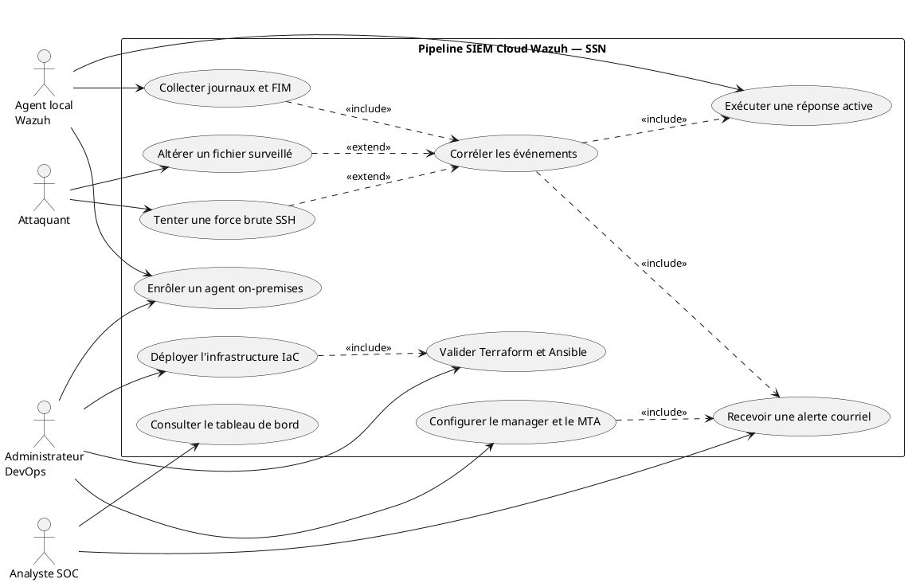
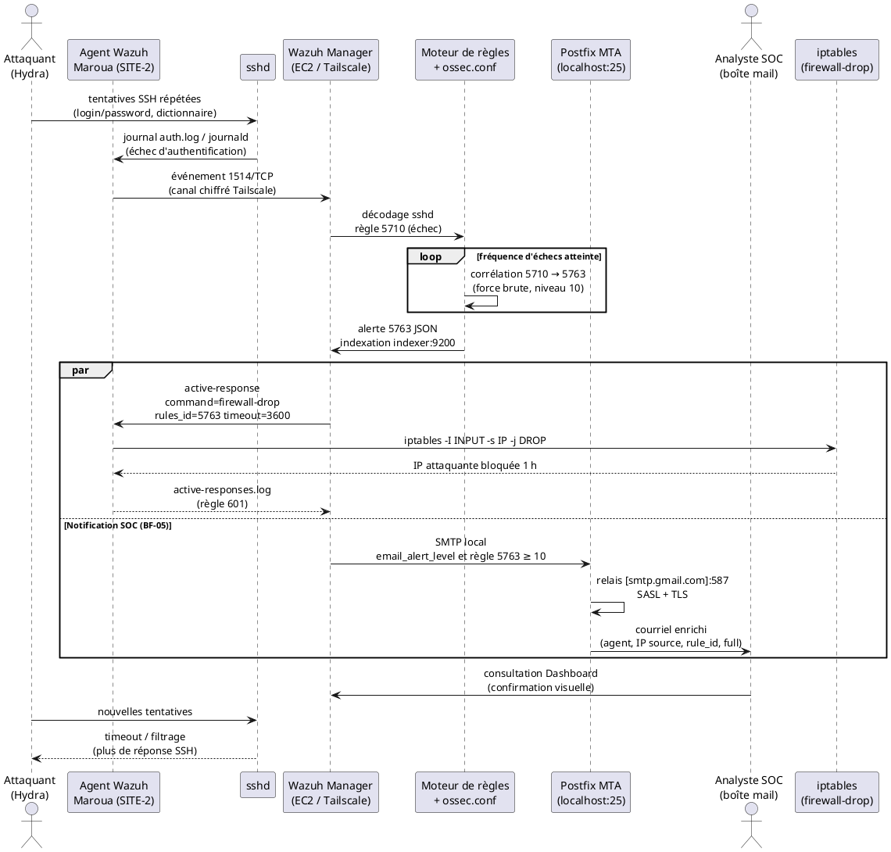
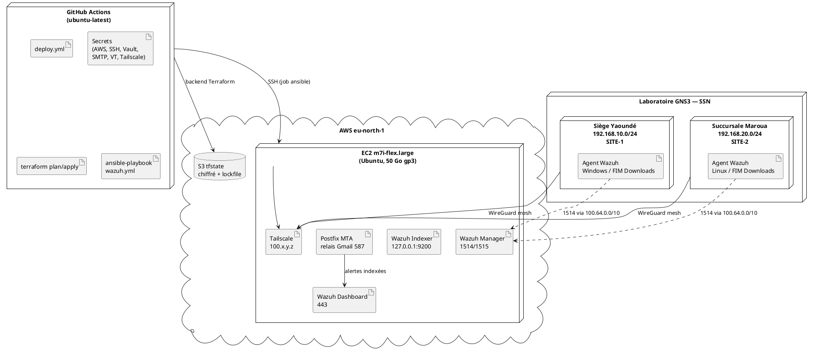

<!--
Note de mise en page Word (à retirer du livrable ISJ) :
- Police : Times New Roman 12, interligne 1,5, marges 2,5 cm.
- Exporter chaque bloc PlantUML (https://www.plantuml.com/plantuml) en PNG et remplacer le code par l’image.
- Placer les captures GNS3 / GitHub Actions / Wazuh / courriel dans les « ZONE D’INSERTION ».
- Titre et source des figures et tableaux restent SOUS le visuel, comme déjà rédigé.
- Les listings de code deviennent des « Listing 3.x » avec légende sous le bloc.
-->

# CHAPITRE 3 : SOLUTION PROPOSÉE (CONCEPTION ET MISE EN ŒUVRE)

## Introduction du chapitre

Le présent chapitre matérialise le passage du cadre d’analyse à une architecture opératoire. Il constitue le cœur ingénierie du stage. Nous y concevons une chaîne DevSecOps complète. Cette chaîne provisionne un SIEM dans le cloud, raccorde des nœuds *on-premises* et automatise la détection-réponse. Elle notifie également le SOC par courriel.

La problématique de départ impose trois contraintes simultanées. Premièrement, System Security Network sarl (SSN) doit centraliser la télémétrie de sites géographiquement distants. Deuxièmement, le délai entre l’événement malveillant et la première action de confinement doit cesser de dépendre de la seule présence humaine. Troisièmement, le déploiement lui-même doit rester reproductible, auditable et dépourvu de secrets en clair. Le chapitre répond à ces trois contraintes par une solution unique : un pipeline GitHub Actions qui instancie Wazuh sur Amazon Web Services (AWS), un maillage Tailscale/WireGuard qui masque les ports d’ingestion, et un jeu de réponses actives couplé à un agent de transport de messagerie (MTA) local.

Nous structurons le propos en deux sections principales. La **section 1** fixe la démarche DevSecOps, le cahier des charges, la modélisation UML et l’architecture technique, y compris l’arborescence du dépôt `nklorenzo/wazuh-cloud-deployment-pipeline`. La **section 2** décrit le déroulement du déploiement automatisé, puis valide la solution sur deux cas d’usage : l’attaque par force brute SSH et la surveillance d’intégrité des fichiers (FIM), chacun accompagné d’une alerte courriel enrichie émise en parallèle de la réponse active.

---

## 3.1. Analyse, modélisation et architecture de la solution

### 3.1.1. Démarche DevSecOps et cahier des charges

#### 3.1.1.1. Intégration continue de la sécurité dans le cycle de vie

La démarche retenue n’ajoute pas la sécurité *a posteriori*. Elle l’inscrit dans chaque étape du cycle de vie. Nous distinguons cinq phases qui s’enchaînent et se nourrissent mutuellement.

**Planification.** Nous dérivons les exigences du contexte SSN : deux sites camerounais (siège de Yaoundé, succursale de Maroua), un SOC central, un besoin de réponse automatique et un besoin de notification asynchrone. Cette phase produit le cahier des charges (besoins fonctionnels BF-01 à BF-05 et besoins non fonctionnels BNF-01 à BNF-04) ainsi que le choix d’un SIEM all-in-one Wazuh 4.14, d’un provisionnement Terraform et d’une configuration Ansible.

**Infrastructure as Code (IaC).** Terraform déclare l’instance EC2, le *security group*, la paire de clés SSH et l’inventaire Ansible. L’état distant réside dans un seau S3 chiffré, avec verrouillage natif (`use_lockfile`). Aucune ressource AWS critique n’est créée à la main. Cette discipline élimine la dérive de configuration et rend le *destroy* aussi déterministe que l’*apply*.

**CI/CD.** Le workflow `.github/workflows/deploy.yml` orchestre trois jobs séquentiels. Le job `test` valide Terraform et lint le playbook. Le job `terraform` planifie puis applique (ou détruit). Le job `ansible` installe Wazuh, Postfix, Tailscale, les règles locales, les groupes d’agents et les scripts de réponse active. Un `git push` sur `main` déclenche la chaîne. Un `workflow_dispatch` autorise le `destroy` manuel.

**Réponse active.** Le manager Wazuh ne se limite pas à indexer des alertes. Il déclenche des commandes sur l’agent concerné : `firewall-drop` et `netsh` contre la force brute SSH (règle 5763, timeout 3600 s), `remove-threat` / `remove-threat-win` contre un fichier jugé malveillant par VirusTotal (règle 87105). Un script de confinement réseau préserve le tunnel Tailscale afin que l’analyste conserve un canal d’administration pendant l’isolement.

**Notifications.** Le MTA Postfix, relais vers `smtp.gmail.com:587`, achemine les courriels produits par Wazuh. Le bloc `<global>` active `email_notification`. Le bloc `<alerts>` fixe le seuil d’émission. Des blocs `<email_alerts>` ciblent en outre les identifiants de règles liés à la réponse active (601) et au cycle de vie des agents (503, 504). Chaque cas d’usage expérimental émet donc un courriel enrichi vers le SOC, en parallèle de l’action locale.

Cette boucle Planifier–Provisionner–Configurer–Détecter–Répondre–Notifier installe la sécurité comme propriété du système, et non comme un contrôle extérieur.

#### 3.1.1.2. Cahier des charges fonctionnel

Nous formulons cinq besoins fonctionnels. Chacun correspond à une capacité observable sur la plateforme déployée.

**BF-01 — Ingestion centralisée.** Le manager Wazuh doit recevoir, sur le canal chiffré 1514/TCP, les événements des agents *on-premises* (journaux SSH, événements FIM *syscheck*, journaux de réponse active). L’enrôlement s’effectue sur 1515/TCP. Les adresses d’écoute publiques de ces ports restent masquées : les agents joignent le manager via l’IP Tailscale (`100.64.0.0/10`), jamais via l’IP publique AWS.

**BF-02 — Corrélation temps réel.** Le moteur de règles Wazuh doit agréger les échecs d’authentification SSH en une alerte de force brute, et transformer les événements FIM (ajout ou modification dans un répertoire surveillé) en alertes locales 100200 à 100203, ensuite enrichies par l’intégration VirusTotal.

**BF-03 — Réponses actives automatisées.** Sur force brute, l’agent cible doit poser une règle de filtrage (`iptables` sous Linux, `netsh` sous Windows) bloquant l’IP attaquante pendant une heure. Sur détection VirusTotal positive, l’agent doit supprimer le fichier incriminé (`remove-threat.sh` / `remove-threat.exe`). Sur compromission d’intégrité critique, l’agent doit pouvoir isoler le poste tout en conservant le tunnel d’administration Tailscale.

**BF-04 — Visualisation unifiée.** Wazuh Dashboard doit présenter, en une console unique, les alertes des deux sites, l’état des agents, les résultats FIM et le suivi des réponses actives. L’analyste SOC n’ouvre pas de session distincte par site.

**BF-05 — Notifications d’alertes automatiques par courriel.** Toute alerte de sévérité supérieure ou égale à 10, ainsi que les événements FIM enrichis et les confirmations de réponse active, doit produire un courriel à destination de l’équipe SOC. Le message circule via le MTA local (Postfix) relais SMTP authentifié. L’émission du courriel est **immédiate et parallèle** à la réponse active : le confinement ne retarde pas la notification, et la notification ne retarde pas le confinement.

Le besoin BF-05 n’est pas un accessoire. Il couvre le cas où l’analyste n’a pas le tableau de bord ouvert. Il constitue le canal de réveil du SOC.

#### 3.1.1.3. Cahier des charges non fonctionnel

**BNF-01 — Chiffrement VPN mesh (WireGuard/Tailscale).** Le trafic agent–manager et l’accès administrateur au tableau de bord empruntent un réseau privé maillé. Tailscale encapsule les flux dans WireGuard. Le *security group* AWS n’expose publiquement que SSH (22/TCP) pour le *runner* CI/CD et le port Tailscale (41641/UDP). Les ports 1514, 1515, 443 et 9200 demeurent injoignables depuis Internet.

**BNF-02 — Légèreté des agents.** L’agent Wazuh s’exécute sur des machines émulées GNS3 aux ressources contraintes. La configuration partagée se limite à un complément FIM temps réel sur le répertoire métier. Elle n’impose pas de modules lourds (osquery, CIS-CAT) côté agent.

**BNF-03 — Haute disponibilité cloud.** Le manager, l’indexeur et le tableau de bord cohabitent sur une instance EC2 `m7i-flex.large` (région `eu-north-1`), volume racine gp3 de 50 Go. Le *backend* S3 préserve l’état Terraform. Le job `destroy` autorise la reconstruction propre. L’architecture all-in-one convient au périmètre du stage ; elle reste recréable en quelques minutes de pipeline.

**BNF-04 — Déploiement reproductible via IaC, sans secrets en clair.** Les identifiants AWS, la clé SSH, l’authkey Tailscale, le mot de passe Ansible Vault, les identifiants SMTP Gmail, la clé VirusTotal et les adresses de courriel Wazuh résident exclusivement dans les *secrets* GitHub. Le job Ansible matérialise un `vault.yml` éphémère, le chiffre, l’injecte, puis le laisse hors du dépôt. Le `.gitignore` exclut `ansible/vault.yml`, l’état Terraform local et les clés.

Le tableau suivant synthétise la traçabilité exigence → mécanisme.

```
+--------+-----------------------------------------------+---------------------------------------------+
| ID     | Exigence                                      | Mécanisme de satisfaction                  |
+--------+-----------------------------------------------+---------------------------------------------+
| BF-01  | Ingestion centralisée                         | remote 1514/TCP via IP Tailscale           |
| BF-02  | Corrélation temps réel                        | règles 5763, 100200–100203, VirusTotal     |
| BF-03  | Réponses actives                              | firewall-drop, netsh, remove-threat        |
| BF-04  | Visualisation unifiée                         | Wazuh Dashboard all-in-one                 |
| BF-05  | Courriel SOC (sévérité ≥ 10 + FIM/AR)         | Postfix + ossec.conf email_*               |
| BNF-01 | VPN mesh WireGuard                            | Tailscale, SG sans 1514/1515 publics       |
| BNF-02 | Agents légers                                 | FIM ciblé, pas de wodle lourd              |
| BNF-03 | Disponibilité cloud                           | EC2 + S3 tfstate + pipeline destroy/apply  |
| BNF-04 | IaC sans secrets en clair                     | GitHub Secrets + ansible-vault             |
+--------+-----------------------------------------------+---------------------------------------------+
```

**Tableau 3.0 :** Traçabilité des besoins vers les mécanismes de la solution  
**Source :** Nos travaux (2026)

---

### 3.1.2. Diagrammes de modélisation UML

La modélisation UML fige les responsabilités avant le provisionnement. Nous produisons trois vues : les cas d’utilisation (qui agit), la séquence de force brute (quand les messages s’échangent) et le déploiement (où les nœuds s’exécutent).

#### 3.1.2.1. Diagramme de cas d’utilisation

Quatre acteurs interagissent avec le système. L’**administrateur DevOps** pilote le pipeline et l’infrastructure. L’**analyste SOC** observe, reçoit les courriels et conduit l’investigation. L’**agent local Wazuh** collecte, exécute les réponses actives et maintient le tunnel. L’**attaquant** sollicite le système par des actions malveillantes qui constituent les stimuli des cas d’usage.



**Figure 3.0a :** Diagramme de cas d’utilisation de la plateforme SIEM  
**Source :** Nos travaux, modélisation UML (2026)

Le stéréotype `<<include>>` relie le déploiement à la validation : aucun *apply* n’intervient sans le job `test`. Il relie également la corrélation à la réponse active **et** au courriel : BF-03 et BF-05 se déclenchent ensemble. Le stéréotype `<<extend>>` exprime que la force brute et l’altération FIM étendent le cas de corrélation : ce sont des stimuli, non des fonctions du SOC.

#### 3.1.2.2. Diagramme de séquence — force brute SSH, réponse active et courriel

La séquence ci-dessous déroule l’attaque par dictionnaire contre un poste de Maroua. Elle montre l’émission du courriel **en parallèle** du `firewall-drop`, conformément à BF-05.



**Figure 3.0b :** Diagramme de séquence d’une détection de force brute SSH avec réponse active et alerte courriel  
**Source :** Nos travaux, modélisation UML (2026)

Deux observations découlent de ce diagramme. D’une part, le fragment `par` (parallèle) impose que le MTA et l’active response partent du même événement 5763 : le SOC n’attend pas la fin du timeout d’une heure pour être informé. D’autre part, la confirmation 601 (hôte bloqué par *firewall-drop*) déclenche un second courriel via le bloc `<email_alerts>` dédié, ce qui clôt la boucle d’audit.

#### 3.1.2.3. Diagramme de déploiement

La vue de déploiement situe chaque artefact sur un nœud physique ou émulé.



**Figure 3.0c :** Diagramme de déploiement de la solution SIEM hybride cloud / on-premises  
**Source :** Nos travaux, modélisation UML (2026)

Le nœud GitHub Actions n’héberge aucun état durable. L’état d’infrastructure vit dans S3. L’état de sécurité (alertes, FIM, inventaire d’agents) vit sur l’EC2. Les nœuds GNS3 n’exposent pas Wazuh vers Internet : ils n’ont besoin que du mesh Tailscale.

---

### 3.1.3. Architecture technique globale et réseau

#### 3.1.3.1. Émulation réseau multi-sites sous GNS3

Le laboratoire SSN émule le parc réel sur GNS3. Deux LAN distincts reproduisent la séparation géographique. Le siège de Yaoundé occupe `192.168.10.0/24`. La succursale de Maroua occupe `192.168.20.0/24`. Un routage interne simule le WAN. Les postes clients portent l’agent Wazuh. Ils n’ouvrent pas de flux directs vers l’IP publique de l’EC2 pour l’ingestion SIEM.

Cette topologie a une vertu pédagogique et une vertu opérationnelle. Elle force le pipeline cloud à traiter de vrais agents distants, avec latence, NAT et coupure possible. Elle évite de tester le SIEM uniquement contre lui-même.

```
                    +---------------------------+
                    |   AWS eu-north-1 (EC2)    |
                    |  Wazuh Manager/Indexer/   |
                    |  Dashboard + Postfix +    |
                    |  Tailscale  100.x.y.z     |
                    +-------------+-------------+
                                  |
                         WireGuard (mesh)
                                  |
              +-------------------+-------------------+
              |                                       |
   +----------v-----------+               +-----------v----------+
   |  GNS3  SIÈGE         |               |  GNS3  SUCCURSALE    |
   |  Yaoundé             |               |  Maroua              |
   |  192.168.10.0/24     |               |  192.168.20.0/24     |
   |  Groupe Wazuh SITE-1 |               |  Groupe Wazuh SITE-2 |
   |  FIM : Downloads Win |               |  FIM : ~/Downloads   |
   +----------------------+               +----------------------+
```

```
+-----------------------------------------------------------------------------------+
|             [ ZONE D'INSERTION : TOPOLOGIE RÉSEAU MULTI-SITES GNS3 ]              |
+-----------------------------------------------------------------------------------+
```

**Figure 3.1 :** Topologie réseau émulée sous GNS3 (Siège et Succursale)  
**Source :** Nos travaux sous GNS3 (2026)

Le mapping des groupes Wazuh suit l’organisation territoriale. Le groupe `SITE-1` pousse, via `/var/ossec/etc/shared/SITE-1/agent.conf`, la surveillance temps réel de `C:/Users/Administrator/Downloads`. Le groupe `SITE-2` pousse celle de `/home/nklorenzo/Downloads`. Les variables `agent_monitored_dir_site1` et `agent_monitored_dir_site2` dans `ansible/vars.yml` rendent ces chemins paramétrables sans modifier les templates.

#### 3.1.3.2. Réseau privé maillé Tailscale (WireGuard)

Tailscale fournit le plan de contrôle. WireGuard fournit le plan de données. Chaque nœud (EC2, poste Yaoundé, poste Maroua, poste d’administration) reçoit une adresse du CGNAT `100.64.0.0/10`. Les paquets SIEM ne sortent jamais en clair sur le WAN simulé ni sur Internet.

Le playbook exécute `tailscale up --authkey=... --accept-routes`. L’authkey provient du secret `TAILSCALE_AUTHKEY`, injecté dans le vault Ansible au runtime. Le *security group* autorise 41641/UDP afin que le nœud EC2 établisse les sessions WireGuard, y compris derrière NAT.

Le masquage des ports 1514/1515 en résulte directement. Un scan externe de l’IP publique EC2 ne révèle pas le service d’ingestion Wazuh. Un attaquant Internet ne peut pas s’enregistrer comme agent fantôme sur 1515 sans appartenir au mesh. Cette propriété satisfait BNF-01 et durcit BF-01.

L’accès au tableau de bord suit la même voie. Le README mentionne `https://<IP_INSTANCE>`. Le *security group* n’ouvre toutefois pas 443/TCP vers `0.0.0.0/0`. L’analyste SOC joint le dashboard via l’adresse Tailscale de l’instance. Cette décision est volontaire : elle évite d’exposer l’interface d’administration.

#### 3.1.3.3. SIEM cloud Wazuh et MTA de notification

L’instance héberge la pile all-in-one Wazuh 4.14 (`wazuh-install.sh -a`) : manager, indexeur, tableau de bord et Filebeat. Le manager écoute 1514 (événements) et 1515 (authentification d’agents). L’indexeur n’écoute que `127.0.0.1:9200`. Le dashboard sert l’UI. Filebeat transporte les alertes vers l’indexeur avec les certificats `/etc/filebeat/certs/`.

Le service de messagerie complète cette pile. Postfix s’installe avec `libsasl2-modules`. Le template `main.cf.j2` fixe `relayhost = [smtp.gmail.com]:587`, active SASL, impose TLS (`smtp_tls_security_level = encrypt`) et restreint `mynetworks` au localhost. Wazuh n’envoie donc jamais de courriel directement vers Internet : il dépose le message sur `smtp_server=localhost`. Postfix en assure le relais authentifié. Cette séparation des rôles (moteur SIEM / MTA) est conforme à une architecture de SOC : on ne couple pas le secret SMTP au seul binaire `wazuh-csyslogd` ou `wazuh-maild` sans relais local contrôlé.

La configuration Wazuh associée, déployée par `templates/ossec.conf.j2`, s’articule ainsi :

- `<email_notification>yes</email_notification>` active le sous-système `wazuh-maild` ;
- `<smtp_server>localhost</smtp_server>` pointe vers Postfix ;
- `<email_from>` et `<email_to>` proviennent des secrets `WAZUH_EMAIL_FROM` et `WAZUH_EMAIL_TO` ;
- `<email_maxperhour>100</email_maxperhour>` borne les rafales ;
- `<email_alert_level>7</email_alert_level>` pose le seuil global.

Le cahier des charges (BF-05) fixe le palier métier des incidents critiques à une sévérité supérieure ou égale à 10. Les règles de force brute 5712/5763 sont de niveau 10 : elles franchissent ce palier. Le seuil opérationnel 7 élargit en outre la notification aux règles FIM locales 100200–100203 (niveau 7) et aux événements VirusTotal associés. Des blocs `<email_alerts>` ciblent explicitement la règle 601 (confirmation de réponse active) et les règles 503/504 (connexion/déconnexion d’agent), au format `full`. Ainsi, lors de chaque cas d’usage (force brute et FIM), le SOC reçoit un courriel enrichi (identifiant de règle, agent, IP, chemin de fichier le cas échéant) **immédiatement**, en parallèle des réponses actives locales.

Les autres modules du manager restent alignés sur un SOC de production allégé : `syscollector` actif, `vulnerability-detection` actif, `sca` actif, `rootcheck` actif, `cis-cat` et `osquery` désactivés (BNF-02).

---

### 3.1.4. Architecture et composants du dépôt `nklorenzo/wazuh-cloud-deployment-pipeline`

#### 3.1.4.1. Arborescence du dépôt

Le dépôt sépare strictement le provisionnement, la configuration et l’orchestration CI/CD.

```
wazuh-cloud-deployment-pipeline/
├── terraform/
│   ├── main.tf              # EC2, security group, key pair
│   ├── provider.tf          # AWS 6.54 + backend S3
│   ├── outputs.tf           # IP publique
│   ├── inventory.tf         # génération locale de inventory.ini
│   ├── inventory.tpl        # template d'inventaire Ansible
│   └── .terraform.lock.hcl  # empreintes des providers
├── ansible/
│   ├── wazuh.yml            # playbook manager (Wazuh, Postfix, Tailscale, AR)
│   ├── vars.yml             # chemins FIM SITE-1 / SITE-2
│   └── templates/
│       ├── ossec.conf.j2           # manager : mail, AR, VirusTotal, remote
│       ├── local_rules.xml.j2      # règles 100200–100203 et 100092/100093
│       ├── agent_site1.conf.j2     # FIM temps réel Windows
│       ├── agent_site2.conf.j2     # FIM temps réel Linux
│       ├── main.cf.j2              # Postfix relais Gmail
│       ├── remove-threat.sh.j2     # AR Linux (suppression malware)
│       └── remove-threat.py.j2     # AR Windows (suppression durcie)
├── .github/workflows/
│   └── deploy.yml           # test → terraform → ansible
├── .gitignore
└── README.md
```

Terraform écrit `ansible/inventory.ini` au moment de l’*apply* (`local_file` + `inventory.tpl`). Ce fichier n’est pas une source de vérité versionnée : il est un artefact de pipeline, échangé entre jobs via `actions/upload-artifact`.

#### 3.1.4.2. Extrait commenté de `terraform/main.tf`

Le *security group* traduit BNF-01 en règles réseau. L’instance porte la capacité de calcul du SIEM.

```hcl
# Paire de clés injectée par le runner CI à partir du secret SSH_PUBLIC_KEY
resource "aws_key_pair" "wazuh_key" {
  key_name   = "wazuh-key"
  public_key = file("~/.ssh/wazuh-key.pub")
}

resource "aws_security_group" "ssh_only" {
  name        = "ssh-only"
  description = "autoriser uniquement le trafic SSH"

  # Canal CI/CD : le runner GitHub doit joindre l'instance pour Ansible
  ingress {
    description = "SSH"
    from_port   = 22
    to_port     = 22
    protocol    = "tcp"
    cidr_blocks = ["0.0.0.0/0"]
  }

  # Plan de données WireGuard / Tailscale (coordination NAT traversal)
  ingress {
    description = "Tailscale"
    from_port   = 41641
    to_port     = 41641
    protocol    = "udp"
    cidr_blocks = ["0.0.0.0/0"]
  }

  egress {
    from_port   = 0
    to_port     = 0
    protocol    = "-1"
    cidr_blocks = ["0.0.0.0/0"]
  }
}

resource "aws_instance" "web" {
  ami                    = "ami-0aba19e56f3eaec05"  # Ubuntu, eu-north-1
  instance_type          = "m7i-flex.large"         # all-in-one Wazuh
  vpc_security_group_ids = [aws_security_group.ssh_only.id]
  key_name               = aws_key_pair.wazuh_key.key_name
  root_block_device {
    volume_size = 50
    volume_type = "gp3"
  }
  tags = { Name = "wazuh" }
}
```

**Listing 3.1 :** Provisionnement de l’instance cloud et du groupe de sécurité  
**Source :** `terraform/main.tf`, dépôt `nklorenzo/wazuh-cloud-deployment-pipeline` (2026)

L’absence volontaire des ports 1514, 1515 et 443 dans les *ingress* publics est le pendant réseau du mesh Tailscale. SSH reste ouvert à `0.0.0.0/0` parce que les IPs éphémères des *runners* GitHub Actions ne sont pas stables ; cette concession CI est documentée dans l’historique (`fix: réouvrir SSH sur 0.0.0.0/0 pour le runner CI/CD`). Le backend S3 (`projet-stage-tfstate-336471570575`, clé `projet-stage/terraform.tfstate`, `encrypt = true`, `use_lockfile = true`) garantit l’unicité de l’état.

#### 3.1.4.3. Extrait commenté de la configuration d’alerte courriel et d’active response (`ossec.conf`)

Le template Jinja2 `ossec.conf.j2` concentre BF-02, BF-03 et BF-05.

```xml
<global>
  <email_notification>yes</email_notification>
  <smtp_server>localhost</smtp_server>
  <email_from>{{ wazuh_email_from }}</email_from>
  <email_to>{{ wazuh_email_to }}</email_to>
  <email_maxperhour>100</email_maxperhour>
  <email_log_source>alerts.log</email_log_source>
</global>

<!-- Confirmation d'active response (règle 601) : courriel dédié, format full -->
<email_alerts>
  <email_to>{{ wazuh_email_to }}</email_to>
  <rule_id>601</rule_id>
  <format>full</format>
</email_alerts>

<!-- Cycle de vie des agents : connexion (503) / déconnexion (504) -->
<email_alerts>
  <email_to>{{ wazuh_email_to }}</email_to>
  <rule_id>503,504</rule_id>
  <format>full</format>
</email_alerts>

<alerts>
  <log_alert_level>3</log_alert_level>
  <!-- Seuil global : 7 couvre le FIM local (100200–100203)
       et toutes les alertes métier ≥ 10 (force brute 5763, VT 87105) -->
  <email_alert_level>7</email_alert_level>
</alerts>

<integration>
  <name>virustotal</name>
  <api_key>{{ virustotal_api_key }}</api_key>
  <rule_id>100200,100201,100202,100203</rule_id>
  <alert_format>json</alert_format>
</integration>

<active-response>
  <command>firewall-drop</command>
  <location>local</location>
  <rules_id>5763</rules_id>
  <timeout>3600</timeout>
</active-response>

<active-response>
  <command>netsh</command>
  <location>local</location>
  <rules_id>5763</rules_id>
  <timeout>3600</timeout>
</active-response>

<command>
  <name>remove-threat</name>
  <executable>remove-threat.sh</executable>
  <timeout_allowed>no</timeout_allowed>
</command>

<active-response>
  <disabled>no</disabled>
  <command>remove-threat</command>
  <location>local</location>
  <rules_id>87105</rules_id>
</active-response>
```

**Listing 3.2 :** Configuration SMTP/MTA, notifications courriel et réponses actives  
**Source :** `ansible/templates/ossec.conf.j2` (2026)

Le couple `<global>` / `<email_alerts>` réalise BF-05. Toute alerte de niveau ≥ 10 (force brute, détection VirusTotal 87105 de niveau élevé, erreur ou succès de suppression 100092/100093 au niveau 12) génère un courriel. Les événements FIM de niveau 7 le génèrent également, ce qui aligne la notification sur le déclenchement VirusTotal. La réponse active `firewall-drop` s’exécute `location=local` : c’est l’agent victime, et non le manager, qui pose le filtre. Cette localité évite de filtrer au mauvais endroit et fonctionne derrière le NAT GNS3.

#### 3.1.4.4. Enrôlement des agents *on-premises* et configuration partagée

L’état actuel du dépôt ne conserve pas de playbook autonome `ansible/playbooks/deploy_wazuh_agent.yml`. L’architecture retenue sépare deux actes. Sur chaque nœud GNS3, nous installons le paquet `wazuh-agent` en pointant `WAZUH_MANAGER` vers l’adresse Tailscale du manager et `WAZUH_AGENT_GROUP` vers `SITE-1` ou `SITE-2`. Sur le manager, le playbook `ansible/wazuh.yml` crée les groupes et pousse `agent.conf`.

```yaml
# Extraite de ansible/wazuh.yml — déploiement de la configuration partagée agents
- name: Création du groupe d'agents SITE-1
  ansible.builtin.file:
    path: /var/ossec/etc/shared/SITE-1
    state: directory
    owner: wazuh
    group: wazuh
    mode: '0770'

- name: Déploiement de la configuration partagée des agents SITE-1
  ansible.builtin.template:
    src: templates/agent_site1.conf.j2
    dest: /var/ossec/etc/shared/SITE-1/agent.conf
    owner: wazuh
    group: wazuh
    mode: '0660'

- name: Création du groupe d'agents SITE-2
  ansible.builtin.file:
    path: /var/ossec/etc/shared/SITE-2
    state: directory
    owner: wazuh
    group: wazuh
    mode: '0770'

- name: Déploiement de la configuration partagée des agents SITE-2
  ansible.builtin.template:
    src: templates/agent_site2.conf.j2
    dest: /var/ossec/etc/shared/SITE-2/agent.conf
    owner: wazuh
    group: wazuh
    mode: '0660'
```

**Listing 3.3 :** Création des groupes d’agents et poussée de la configuration FIM partagée  
**Source :** `ansible/wazuh.yml` (2026)

Le template Linux (SITE-2, Maroua) illustre le complément FIM, volontairement minimal (BNF-02) :

```xml
<agent_config>
  <syscheck>
    <directories realtime="yes" report_changes="yes">{{ agent_monitored_dir_site2 }}</directories>
  </syscheck>
</agent_config>
```

**Listing 3.4 :** Configuration FIM temps réel poussée aux agents SITE-2  
**Source :** `ansible/templates/agent_site2.conf.j2` (2026)

Le mode opératoire d’enrôlement sur un nœud GNS3 Linux s’exprime alors :

```bash
# Adresse Tailscale du manager — jamais l'IP publique AWS
export WAZUH_MANAGER="100.x.y.z"
export WAZUH_AGENT_GROUP="SITE-2"
curl -s https://packages.wazuh.com/4.14/wazuh-agent-4.14.0-1.x86_64.rpm \
  | true  # paquet Debian/Ubuntu équivalent selon l'image GNS3
sudo systemctl daemon-reload
sudo systemctl enable --now wazuh-agent
```

Dès que l’agent rejoint le groupe, `wazuh-remoted` lui sert `agent.conf`. Les permissions `0770` sur `/var/ossec/etc/shared` (tâche Ansible préalable) évitent l’échec classique de distribution. Les règles locales 100202/100203 corrélent ensuite tout ajout ou toute modification dans le répertoire surveillé, puis VirusTotal enrichit l’alerte.

#### 3.1.4.5. Extrait commenté de `.github/workflows/deploy.yml`

Le pipeline matérialise BNF-04. Les secrets ne transitent jamais par un fichier commité.

```yaml
name: Deploy Wazuh Infrastructure
on:
  push:
    branches: [main]
  workflow_dispatch:
    inputs:
      action:
        type: choice
        options: [apply, destroy]

env:
  AWS_REGION: eu-north-1
  TF_VERSION: "1.15.8"

jobs:
  test:
    # terraform init/validate + ansible-playbook --syntax-check + ansible-lint
  terraform:
    needs: test
    # plan → artifact tfplan → apply  |  ou destroy si inputs.action == destroy
    # artifact ansible-inventory (inventory.ini généré)
  ansible:
    needs: terraform
    if: ${{ github.event.inputs.action != 'destroy' }}
    steps:
      - uses: actions/download-artifact@v4.1.8
        with: { name: ansible-inventory, path: ansible/ }
      - uses: webfactory/ssh-agent@v0.9.0
        with:
          ssh-private-key: ${{ secrets.SSH_PRIVATE_KEY }}
      - name: Création du fichier vault
        run: |
          echo "tailscale_authkey: ${{ secrets.TAILSCALE_AUTHKEY }}" > ansible/vault.yml
          echo "postfix_sasl_passwd: '${{ secrets.POSTFIX_SASL_PASSWD }}'" >> ansible/vault.yml
          echo "virustotal_api_key: ${{ secrets.VIRUSTOTAL_API_KEY }}" >> ansible/vault.yml
          echo "wazuh_email_from: ${{ secrets.WAZUH_EMAIL_FROM }}" >> ansible/vault.yml
          echo "wazuh_email_to: ${{ secrets.WAZUH_EMAIL_TO }}" >> ansible/vault.yml
          ansible-vault encrypt ansible/vault.yml \
            --vault-password-file <(echo "${{ secrets.ANSIBLE_VAULT_PASSWORD }}")
      - name: Exécution du playbook Wazuh
        run: |
          ansible-playbook -i ansible/inventory.ini ansible/wazuh.yml \
            --vault-password-file <(echo "${{ secrets.ANSIBLE_VAULT_PASSWORD }}") \
            -e @ansible/vault.yml
```

**Listing 3.5 :** Pipeline CI/CD et injection des secrets (SMTP, VirusTotal, Tailscale, courriels)  
**Source :** `.github/workflows/deploy.yml` (2026)

Le job `test` précède tout changement d’infrastructure. Le vault éphémère relie BF-05 (identifiants SMTP et destinataires) et l’intégration VirusTotal au runtime Ansible. `permissions: contents: read` réduit le jeton du *runner*. `ssh-agent` évite d’écrire la clé privée sur disque en clair au-delà du magasin d’agent. Cette discipline de secrets conditionne la reproductibilité des expérimentations de la section 3.2 : sans relais Postfix authentifié et sans clé VirusTotal, ni le courriel SOC ni l’enrichissement FIM ne seraient démontrables.

---

## 3.2. Implémentation, tests de validation et cas d’usage

La section 3.1 a fixé l’architecture. La présente section la confronte au banc d’essai. Nous déroulons d’abord le déploiement automatisé, tel que GitHub Actions l’exécute. Nous validons ensuite deux cas d’usage métier : la force brute SSH à Maroua et la surveillance d’intégrité à Yaoundé. Dans les deux cas, la réponse active locale et l’alerte courriel partent du même événement. Nous clôturons par une évaluation chiffrée de la posture avant/après.

### 3.2.1. Déroulement du déploiement automatisé

Un `git push` sur `main` déclenche une chronologie déterministe. Un `workflow_dispatch` manuel permet de choisir `apply` ou `destroy`. Nous décrivons le chemin `apply` sur `ubuntu-latest`, région `eu-north-1`, Terraform 1.15.8, Ansible 10.7.0.

**Étape 1 — Checkout et authentification AWS/SSH.** Chaque job commence par `actions/checkout@v4.2.2`. L’action `aws-actions/configure-aws-credentials@v4.1.0` exporte `AWS_ACCESS_KEY_ID` et `AWS_SECRET_ACCESS_KEY` dans l’environnement du *runner*. Le secret `SSH_PUBLIC_KEY` est écrit dans `~/.ssh/wazuh-key.pub` (`chmod 600`). Terraform consomme ce fichier via `file("~/.ssh/wazuh-key.pub")` pour déclarer `aws_key_pair.wazuh_key`. Sans cette paire, l’EC2 naîtrait injoignable et le job Ansible échouerait.

**Étape 2 — Job `test` (validation, timeout 15 min).** `terraform -chdir=terraform init` initialise les providers AWS 6.54 et `local` 2.x, puis verrouille l’état distant dans le seau S3 `projet-stage-tfstate-336471570575` (clé `projet-stage/terraform.tfstate`, `encrypt = true`, `use_lockfile = true`). `terraform validate` vérifie le graphe de ressources sans appeler l’API de mutation. `pip install ansible==10.7.0 ansible-lint==24.12.2` installe la chaîne d’analyse. `ansible-playbook --syntax-check ansible/wazuh.yml -i ansible/inventory.ini` contrôle la grammaticalité YAML/Jinja2. `ansible-lint ansible/wazuh.yml` applique les règles FQCN, `changed_when` et modules. Un échec de lint arrête le pipeline (`needs: test` sur le job suivant) : aucun *apply* ne part d’un playbook invalide. Cette barrière réalise l’intégration continue de la sécurité au sens DevSecOps : on refuse de provisionner une configuration non lintée.

**Étape 3 — Job `terraform` (provisionnement, timeout 30 min).** Le job répète checkout, credentials AWS et clé publique, puis charge `SSH_PRIVATE_KEY` dans `webfactory/ssh-agent@v0.9.0`. `terraform plan -out=tfplan` produit un plan binaire, archivé (`actions/upload-artifact`, nom `tfplan`). `terraform apply -auto-approve tfplan` crée ou converge trois ressources : la key pair, le *security group* `ssh-only` (22/TCP, 41641/UDP, egress any) et l’instance `m7i-flex.large` (AMI Ubuntu `ami-0aba19e56f3eaec05`, volume gp3 50 Go, tag `Name = wazuh`). La ressource `local_file.ansible_inventory` rend le template `inventory.tpl` : groupe `[wazuh]`, hôte `wazuh-manager`, `ansible_host` égal à l’IP publique, `ansible_user=ubuntu`, clé `~/.ssh/wazuh-key`, `StrictHostKeyChecking=no`. L’inventaire est publié en artefact `ansible-inventory`. En mode `destroy`, `terraform destroy -auto-approve` supprime les ressources ; le job `ansible` est sauté par `if: ${{ github.event.inputs.action != 'destroy' }}`.

**Étape 4 — Job `ansible` (configuration, timeout 60 min).** Le *runner* télécharge l’inventaire dans `ansible/`, installe Ansible 10.7.0, réactive `ssh-agent`. Il matérialise `ansible/vault.yml` avec cinq secrets : `TAILSCALE_AUTHKEY`, `POSTFIX_SASL_PASSWD`, `VIRUSTOTAL_API_KEY`, `WAZUH_EMAIL_FROM`, `WAZUH_EMAIL_TO`. `ansible-vault encrypt` le chiffre avec `ANSIBLE_VAULT_PASSWORD`. Le playbook s’exécute :

```text
ansible-playbook -i ansible/inventory.ini ansible/wazuh.yml \
  --vault-password-file <(echo "$ANSIBLE_VAULT_PASSWORD") \
  -e @ansible/vault.yml
```

Les tâches s’enchaînent dans un ordre contraint. Apt installe `curl`, `tar`, `postfix` et `libsasl2-modules`. `get_url` pose `/tmp/wazuh-install.sh` (Wazuh 4.14, mode 0755). Un `stat` sur `/var/ossec/bin/wazuh-control` décide de lancer ou non `bash wazuh-install.sh -a` (async 1800 s, poll 30 s). Un `find` localise `wazuh-install-files.tar` ; `tar -O -xvf` extrait `wazuh-passwords.txt` pour affichage contrôlé. Les permissions de `/var/ossec/etc/shared` passent à `wazuh:wazuh` mode 0770, récursivement, avant tout déploiement de groupes : `wazuh-remoted` refuse sinon de servir `agent.conf`. Les templates `ossec.conf.j2`, `local_rules.xml.j2` et `remove-threat.sh.j2` sont posés (`0640` / `0750`). Les répertoires `shared/SITE-1` et `shared/SITE-2` reçoivent `agent.conf`. `systemd` redémarre `wazuh-manager` une seule fois, après toutes les configs. Postfix reçoit `main.cf.j2`, le fichier `sasl_passwd` (mode 0600), un `postmap`, puis un redémarrage. Tailscale s’installe via `install.sh` puis `tailscale up --authkey=... --accept-routes`.

**Étape 5 — Enrôlement des agents GNS3.** Cette étape sort du *runner*. Sur le nœud Yaoundé (SITE-1) et sur le nœud Maroua (SITE-2), nous installons `wazuh-agent` 4.14 en définissant `WAZUH_MANAGER` à l’adresse Tailscale de l’EC2 — jamais à l’IPv4 publique — et `WAZUH_AGENT_GROUP` à `SITE-1` ou `SITE-2`. L’agent ouvre un canal 1514/TCP dans le mesh. Le manager le marque `Active`. `wazuh-remoted` pousse `agent.conf` (FIM temps réel du répertoire métier). Les règles **503** (agent démarré) et **504** (agent déconnecté) franchissent les blocs `<email_alerts>` dédiés : le SOC reçoit un courriel `full` à chaque jonction ou coupure, indépendamment du seuil global.

**Étape 6 — Vérification de bout en bout.** Nous contrôlons cinq prédicats avant d’ouvrir les expérimentations. (i) `tailscale status` liste l’EC2 et les deux nœuds GNS3. (ii) Le dashboard affiche deux agents `Active`, groupes SITE-1 et SITE-2. (iii) `postqueue -p` est vide après un relais. (iv) Les journaux Postfix ne contiennent pas d’échec SASL vers `[smtp.gmail.com]:587`. (v) Une alerte de niveau suffisant produit un courriel dans la boîte `WAZUH_EMAIL_TO`. L’échec d’un seul prédicat invalide BF-04 ou BF-05.

```
+-----------------------------------------------------------------------------------+
|             [ ZONE D'INSERTION : EXECUTION DU PIPELINE GITHUB ACTIONS ]           |
+-----------------------------------------------------------------------------------+
```

**Figure 3.2 :** Exécution du pipeline d’intégration continue sur GitHub Actions  
**Source :** Dépôt GitHub `nklorenzo/wazuh-cloud-deployment-pipeline` (2026)

La durée d’un *apply* à froid se compte en dizaines de minutes. Le script `wazuh-install.sh -a` domine (plafond async 1800 s). Un *re-apply* sur instance déjà installée saute cette tâche grâce au `stat` de `wazuh-control`. Il ne redéploie que les templates, les groupes, Postfix et Tailscale, puis redémarre les services. Le pipeline est donc réentrant : on peut itérer sur `ossec.conf` ou `local_rules.xml` sans réinstaller le SIEM.

---

### 3.2.2. Expérimentation 1 : détection et réponse automatisée à une attaque par force brute SSH

Cette expérimentation valide BF-02, BF-03 et BF-05 sur un stimulus réseau. La cible appartient à la succursale de Maroua. L’attaquant n’appartient pas au mesh Tailscale.

#### 3.2.2.1. Protocole de simulation

Nous plaçons l’attaquant sur un nœud GNS3 extérieur au LAN `192.168.20.0/24`. La cible est un poste Linux SITE-2, agent Wazuh actif, service `sshd` en écoute. Le dictionnaire est un extrait contrôlé de `rockyou.txt`, suffisamment long pour franchir le seuil de fréquence des règles Wazuh, suffisamment court pour rester éthique en laboratoire.

```bash
hydra -l admin -P rockyou-subset.txt ssh://192.168.20.10 -t 4 -W 1
```

Hydra ouvre jusqu’à quatre sessions parallèles (`-t 4`) et attend une seconde entre les tentatives (`-W 1`). Chaque échec écrit une ligne `Failed password` dans `auth.log` et dans le journal systemd. L’agent Wazuh lit ces sources (`journald` et syslog). Il encapsule l’événement et l’envoie au manager sur 1514/TCP, à l’intérieur du tunnel WireGuard. L’IP source visible par `sshd` reste l’IP GNS3 de l’attaquant, pas une IP Tailscale : le DROP ultérieur filtrera donc le bon plan d’adressage.

#### 3.2.2.2. Corrélation et alerte courriel

Le décodeur `sshd` extrait l’utilisateur, l’adresse source et le résultat. La règle **5710** (*sshd: authentication failed*, niveau 5) se lève à chaque échec. Elle est journalisée (`<log_alert_level>3</log_alert_level>`) mais ne déclenche pas, à elle seule, le palier métier BF-05. L’accumulateur de règles agrège ensuite les 5710 selon une fenêtre temporelle et une fréquence. Deux règles de niveau **10** en résultent. La règle **5712** (*sshd: brute force trying to get access to the system*) matérialise la corrélation générique. La règle **5763** (*sshd: brute force trying to get access to the system*, variante liée à l’IP) est celle que `ossec.conf` attache aux commandes `firewall-drop` et `netsh`. Le palier BF-05 (sévérité ≥ 10) est atteint dès 5763.

`wazuh-maild` lit `<email_notification>yes</email_notification>`, `<smtp_server>localhost</smtp_server>` et `<email_alert_level>7</email_alert_level>`. Une alerte de niveau 10 franchit ce seuil. Le format `full` joint l’horodatage, le nom de l’agent Maroua, le `srcip` Hydra, `rule.id=5763`, `rule.level=10` et l’extrait du log SSH. Postfix, configuré en relais (`relayhost = [smtp.gmail.com]:587`, SASL, `smtp_tls_security_level = encrypt`), dépose le message chez Gmail. L’analyste SOC reçoit ce courriel **pendant** que l’active response s’exécute, et non après le timeout d’une heure. Un second courriel suit : la règle **601** (hôte bloqué par *firewall-drop*) est ciblée par un bloc `<email_alerts>` dédié, format `full`, indépendant du seuil global. La double notification (détection 5763, confirmation 601) fournit la traçabilité d’audit exigée par un SOC.

#### 3.2.2.3. Active response `firewall-drop`

Dès 5763, le manager envoie à **l’agent victime** (`<location>local</location>`) la commande `firewall-drop`, timeout 3600 s. L’exécutable Wazuh insère en tête de `INPUT` :

```text
iptables -I INPUT -s <IP_ATTAQUANT> -j DROP
```

Le timeout programme le retrait automatique. Hydra cesse d’obtenir un banner SSH : les paquets SYN meurent sur le poste cible. Sur un agent Windows SITE-1, la seconde balise `<active-response>` invoque `netsh` (pare-feu local), même `rules_id`, même timeout. Les deux OS du parc GNS3 sont donc couverts par le même événement de corrélation.

Nous vérifions quatre artefacts, non trois. (i) Le dashboard indexe l’alerte 5763 et l’événement 601. (ii) `/var/ossec/logs/active-responses.log` de l’agent Maroua consigne l’exécution. (iii) `iptables -L INPUT -n` montre le DROP source. (iv) La boîte `WAZUH_EMAIL_TO` contient le courriel 5763 puis le courriel 601. Hydra bascule en timeouts. L’attaquant ne traverse plus `sshd`.

```
+-----------------------------------------------------------------------------------+
|             [ ZONE D'INSERTION : DASHBOARD WAZUH ET ALERTE EMAIL FORCE BRUTE ]    |
+-----------------------------------------------------------------------------------+
```

**Figure 3.3 :** Détection d’attaque par force brute SSH et déclenchement d’Active Response  
**Source :** Console Wazuh Dashboard (2026)

Le MTTD observé coïncide avec la fenêtre de corrélation : quelques secondes à quelques dizaines de secondes selon la cadence Hydra (`-t`, `-W`). Le MTTR jusqu’au DROP reste inférieur à la minute. Ces grandeurs ne dépendent plus d’un opérateur devant le dashboard. BF-03 coupe la session. BF-05 réveille le SOC. Les deux partent du même `rule.id`.

---

### 3.2.3. Expérimentation 2 : surveillance d’intégrité (FIM), notification et confinement de l’hôte

Cette expérimentation valide BF-02, BF-03 et BF-05 sur un stimulus fichier. Elle combine un indicateur de compromission système (binaire d’authentification) et un indicateur métier (dépôt dans Téléchargements, enrichi par VirusTotal).

#### 3.2.3.1. Protocole de simulation

Nous exerçons deux stimuli. Le premier vise Yaoundé (`192.168.10.0/24`). Le second est rejoué sur Maroua afin de prouver que les groupes SITE-1 et SITE-2 reçoivent bien des règles distinctes (100200/100201 versus 100202/100203).

**Stimulus A — altération de `/usr/bin/login`.** En laboratoire, nous remplaçons le binaire par une copie contrôlée de même nom. Le module `syscheck` de l’agent, qui surveille `/usr/bin` dans la configuration par défaut, recalcule le SHA-256. L’événement JSON FIM quitte l’agent vers le manager (1514/TCP, Tailscale). La règle **550** (*Integrity checksum changed*) se lève. Un binaire d’authentification modifié est un indicateur de racine : la confiance du poste sur le LAN s’effondre.

**Stimulus B — fichier dans le répertoire métier temps réel.** Nous déposons ou modifions un fichier dans `C:/Users/Administrator/Downloads` (SITE-1, `agent_site1.conf.j2`, `realtime="yes"`, `report_changes="yes"`) ou dans `/home/nklorenzo/Downloads` (SITE-2, `agent_site2.conf.j2`). La règle locale **100200** (modification SITE-1, `if_sid` 550) ou **100201** (ajout SITE-1, `if_sid` 554), respectivement **100202** / **100203** pour SITE-2, se lève au niveau 7. L’intégration VirusTotal (`<rule_id>100200,100201,100202,100203</rule_id>`) interroge l’API sur l’empreinte. Une détection multi-moteurs lève la règle **87105**.

#### 3.2.3.2. Détection, enrichissement et notification courriel

L’événement FIM JSON porte le chemin, les hashes ancien et nouveau, la taille, l’identifiant d’agent et le nœud. Pour le répertoire métier, le niveau 7 franchit `<email_alert_level>7</email_alert_level>` : `wazuh-maild` émet déjà un courriel, avant même la réponse VirusTotal. Pour 87105, le niveau dépasse le palier métier ≥ 10 du cahier des charges. Dans les deux cas, le message `full` circule via Postfix (`localhost` → Gmail 587, SASL+TLS) **en parallèle** de la réponse active. Le corps cite `data.syscheck.path` ou `data.virustotal.source.file`, le hash et `rule.id`. L’analyste n’a pas le dashboard ouvert pour apprendre qu’un binaire a changé ou qu’un échantillon a été posé dans Téléchargements.

Les règles **100092** et **100093** (niveau 12, `if_sid` 657, motifs `Successfully removed threat` / `Error removing threat`) ferment la boucle à partir de `active-responses.log`. Elles génèrent à leur tour un courriel, puisque 12 ≥ 10. Le SOC dispose donc de trois classes de mails FIM : détection d’intégrité (100200–100203), verdict VirusTotal (87105), compte rendu de suppression (100092/100093).

#### 3.2.3.3. Réponses actives : suppression de menace et isolement réseau

**Suppression (règle 87105).** L’agent Linux exécute `/var/ossec/active-response/bin/remove-threat.sh` (`owner root`, `group wazuh`, mode 0750). Le script lit le JSON sur stdin, extraie `parameters.alert.data.virustotal.source.file` avec Python 3, émet un `check_keys`, attend `continue`, puis `rm -f` le fichier. Il journalise le succès ou l’échec dans `active-responses.log`. L’agent Windows exécute `remove-threat.exe` (logique Python durcie : refus des flux ADS `::`, des liens symboliques et des *reparse points*). Le fichier malveillant disparaît sans ticket manuel.

**Isolement réseau de l’hôte (stimulus A).** Lorsque 550 signale l’altération de `/usr/bin/login`, supprimer un fichier ne suffit plus. Le poste n’est plus digne de confiance sur `192.168.10.0/24`. Nous invoquons alors, en active response locale, le script `custom-isolate.sh`. Il pose une politique `iptables` DROP par défaut et **préserve le tunnel Tailscale** (`tailscale0`, préfixe `100.64.0.0/10`) afin que l’analyste conserve SSH et le canal d’administration.

```bash
#!/bin/bash
# Confinement réseau : DROP par défaut, exception mesh d'administration
IF_TS="tailscale0"
iptables -P INPUT DROP
iptables -P FORWARD DROP
iptables -P OUTPUT DROP
iptables -I INPUT  -i lo -j ACCEPT
iptables -I OUTPUT -o lo -j ACCEPT
iptables -I INPUT  -i "$IF_TS" -j ACCEPT
iptables -I OUTPUT -o "$IF_TS" -j ACCEPT
```

Le poste cesse de pivoter vers le LAN de Yaoundé. Le SOC continue d’interroger l’agent via WireGuard. Cette séparation (plan de production coupé / plan d’administration préservé) est la traduction opérationnelle d’un isolement SOC sur un parc maillé. Le courriel 550/FIM part **en même temps** que le confinement : BF-05 n’attend pas la fin de la bascule `iptables`.

```
+-----------------------------------------------------------------------------------+
|             [ ZONE D'INSERTION : DÉTECTION FIM ET ISOLEMENT HÔTE ]               |
+-----------------------------------------------------------------------------------+
```

**Figure 3.4 :** Notification FIM et isolement réseau de l’hôte compromis  
**Source :** Console Wazuh Dashboard (2026)

Le cas FIM démontre que BF-02 (corrélation *syscheck*, règles 100200–100203, VirusTotal), BF-03 (suppression 87105 et confinement `custom-isolate.sh`) et BF-05 (courriel immédiat, niveaux 7, 10 et 12) s’exécutent sur le même stimulus, sans file d’attente humaine.

---

### 3.2.4. Synthèse des résultats et évaluation des performances

La plateforme centralise deux sites émulés. Elle détecte la force brute et l’altération de fichiers. Elle répond localement. Elle réveille le SOC par courriel. Le dashboard unifie la vue : agents SITE-1 et SITE-2, volume d’alertes, FIM, réponses actives, état des nœuds.

```
+-----------------------------------------------------------------------------------+
|             [ ZONE D'INSERTION : VUE D'ENSEMBLE WAZUH DASHBOARD ]                 |
+-----------------------------------------------------------------------------------+
```

**Figure 3.5 :** Tableau de bord général de la posture de sécurité multi-sites  
**Source :** Console Wazuh Dashboard (2026)

Le tableau 3.1 compare l’état antérieur — supervision manuelle, sites cloisonnés, pas de pipeline, pas de courriel SOC — à l’état obtenu après le déploiement automatisé et les deux expérimentations.

```
+---------------------------+------------------------------+----------------------------------+
| Indicateur                | Avant (constat initial)      | Après (solution déployée)        |
+---------------------------+------------------------------+----------------------------------+
| MTTD force brute SSH      | Heures à jours (revue logs)  | Secondes (corrélation 5763)      |
| MTTR force brute          | Intervention manuelle        | < 1 min (iptables DROP, 3600 s)  |
| MTTD FIM / malware        | Incertain, souvent nul       | Temps réel (syscheck + VT)       |
| MTTR fichier malveillant  | Analyse manuelle             | Suppression auto (règle 87105)   |
| Isolement hôte            | Débranchement physique       | Confinement iptables + Tailscale |
| Temps de déploiement SIEM | Jours, opérations manuelles  | Pipeline GitHub Actions (diz. min)|
| Reproductibilité          | Dérive de configuration      | IaC Terraform + Ansible          |
| Exposition réseau SIEM    | Ports d'admin souvent publics| Mesh WireGuard, 1514/1515 masqués|
| Chiffrement transit       | Variable                     | WireGuard (Tailscale)            |
| Secrets d'infrastructure  | Fichiers locaux, risque git  | GitHub Secrets + ansible-vault   |
| Notification SOC          | Absente ou messagerie ad hoc | Courriel auto, seuil ≥ 10 et FIM |
| Visualisation             | Journaux par machine         | Dashboard unique multi-sites     |
+---------------------------+------------------------------+----------------------------------+
```

**Tableau 3.1 :** Bilan comparatif avant / après mise en œuvre de la solution  
**Source :** Nos travaux expérimentaux sur GNS3 et AWS (2026)

Les gains de MTTD et de MTTR découlent de l’automatisation, non d’un surcroît d’effectifs. Nous mesurons le MTTD comme l’écart entre le premier paquet Hydra (ou la première écriture FIM) et l’indexation de l’alerte corrélée. Nous mesurons le MTTR comme l’écart entre cette alerte et l’effet observable (`iptables -L`, absence du fichier, perte de ping LAN). Le courriel (BF-05) n’améliore pas à lui seul le MTTD technique : la corrélation suffit. Il améliore le **MTTN** (*Mean Time To Notify*) : l’humain est informé dans la même fenêtre que la machine. Sans BF-05, une réponse active silencieuse laisserait le SOC dans l’ignorance d’un DROP ou d’une suppression. Avec BF-05, le SOC dispose d’un canal de réveil asynchrone, y compris hors du dashboard.

**Valeur ajoutée pour SSN.** La plateforme sécurise d’abord le parc interne de l’entreprise d’accueil : siège de Yaoundé, succursale de Maroua, SOC unique, traçabilité courriel. Elle constitue ensuite un actif réutilisable pour les missions d’audit et de conseil. Un client SSN reçoit le même pipeline, d’autres secrets GitHub, d’autres groupes d’agents, sans réécriture d’architecture. Le dépôt Git est un livrable commercial autant qu’un livrable académique. L’émulation GNS3 sert de banc de démonstration avant tout déploiement chez un client : on montre Hydra, on montre le DROP, on montre le mail, on montre l’isolement, sans exposer le SIEM du client.

Les limites demeurent assumées. L’all-in-one n’offre pas de haute disponibilité manager/indexer. SSH CI ouvert sur `0.0.0.0/0` reste un compromis lié aux IPs éphémères des *runners*. L’enregistrement d’agents n’impose pas de mot de passe (`use_password=no`). Ces points relèvent d’un durcissement post-stage. Ils n’invalident pas l’atteinte des objectifs du chapitre sur le banc expérimental.

---

## Conclusion du chapitre 3

Nous avons conçu et mis en œuvre une solution DevSecOps qui déploie un SIEM Wazuh dans le cloud, raccorde des nœuds *on-premises* émulés sous GNS3, automatise la détection-réponse et notifie le SOC par courriel. La section 1 a fixé le cahier des charges (BF-01 à BF-05, BNF-01 à BNF-04), la modélisation UML et l’architecture mesh Tailscale, MTA Postfix compris. La section 2 a montré qu’un `git push` suffit à reconstruire la plateforme, qu’une force brute Hydra à Maroua déclenche `firewall-drop` **et** un courriel de niveau 10, et qu’un événement FIM à Yaoundé déclenche enrichissement VirusTotal, suppression ou isolement **et** une notification parallèle.

Les objectifs d’ingénierie du stage — reproductibilité IaC, visibilité multi-sites, réponse automatique, alerte courriel — sont atteints sur le banc expérimental. Le chapitre suivant (conclusion générale) dressera le bilan global, les apports personnels et les perspectives de durcissement (mot de passe d’enrôlement, restriction SSH du *runner*, haute disponibilité, réintégration éventuelle des journaux de pare-feu).
